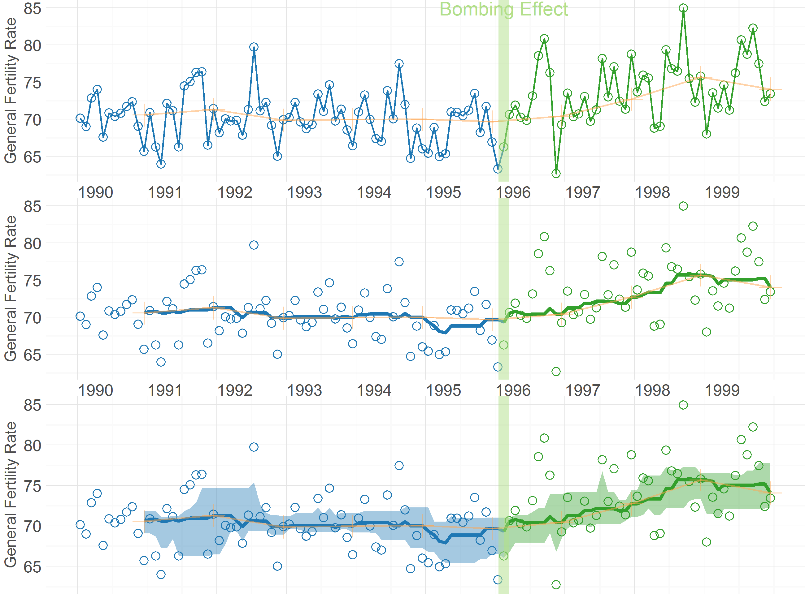
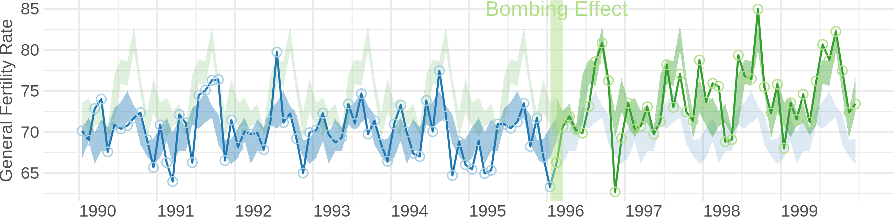
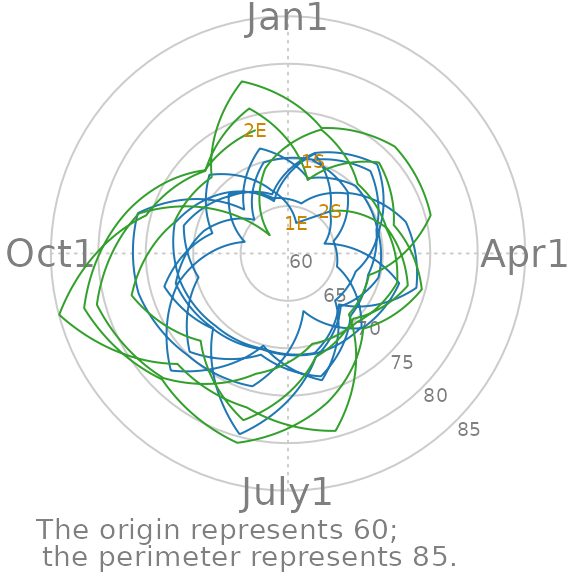
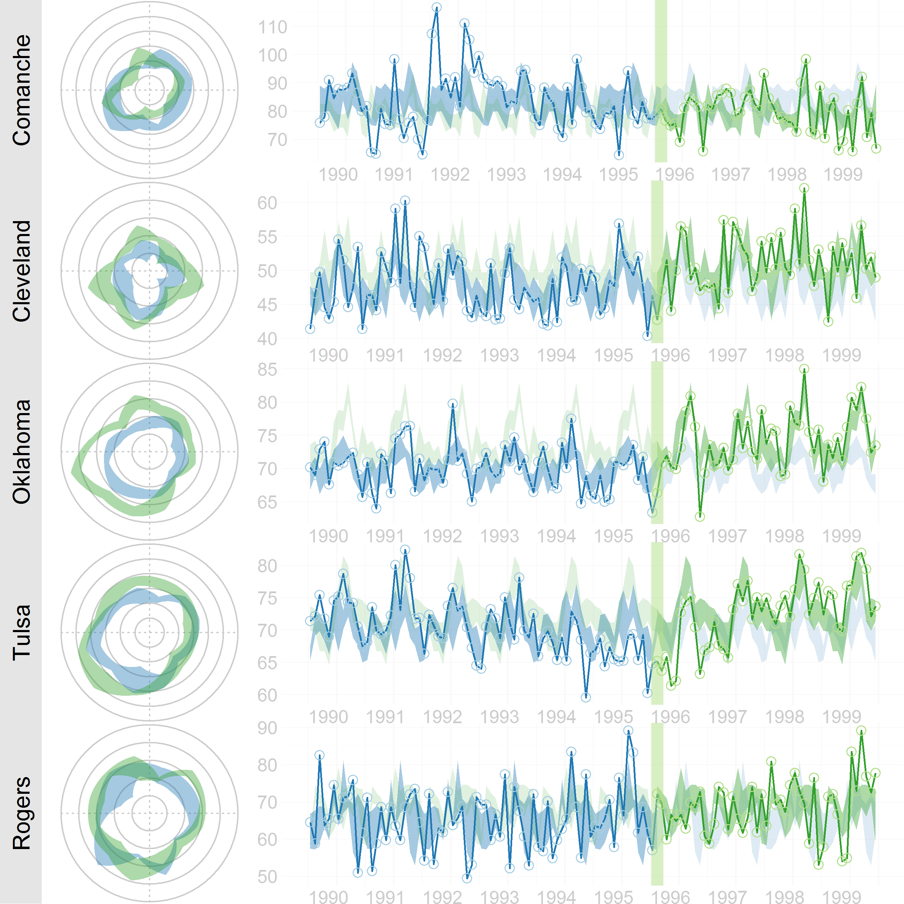
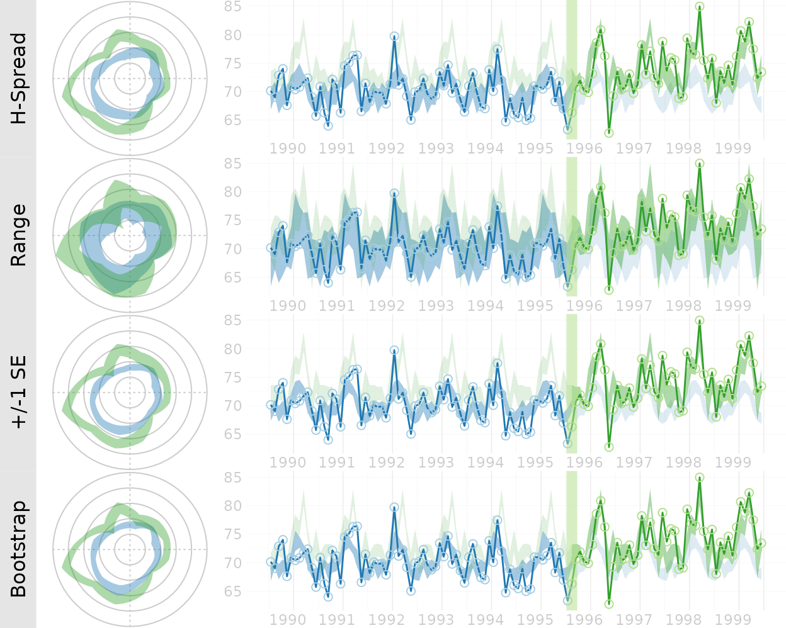

WATS Plots: Wrap Around Time Series
=============================================

## Figure 1: Cartesian Rolling - 2005 Version
Raw monthly birth rates (General Fertility Rates;  GFR's) for Oklahoma County, 1990-1999, plotted in a linear plot;  the "bombing effect" is located ten months after the Oklahoma City bombing.

## Figure 2: Cartesian Rolling - 2014 Version
Smoothed monthly birth rates (General Fertility Rates; GFRs) for Oklahoma County, 1990-1999, plotted in a linear plot.  The top plot shows the connected raw data with a February smoother; the middle plot shows smoothing with a 12-month moving average, blue/green line, superimposed on a February smoother, red line); the bottom plot shows the smoothers and confidence bands, which are H-spreads defined using the distribution of GFR's for the given month and 11 previous months.

## Figure 4: Carteisan Periodic 
Carteisan plot of the GFR time series data in Oklahoma County, with H-spread Bands superimposed.

## Figure 5: Polar Periodic
Wrap Around Time Series (WATS Plot) of the Oklahoma City GFR data, 1990-1999

## Figure 6: WATS and Cartesian
WATS Plot with H-spread bands (top left), with data lines deleted (top right), and the original Cartesian plot (bottom)

## Figure 7: County Comparison
Comparison of Oklahoma County (where the bombing occurred) and four other urban counties.  Cleveland County  shows a smaller but relatively consistent increase;  it is the southern neighbor of Oklahoma County from which many residents commute to work in Oklahoma City, and a number of whose residents were among those killed or injured.  Tulsa County, which also shows a slight increase, is the other large metropolitan county besides Oklahoma county.

## Figure 8: Error Band Comparison
Comparison of four different measures of spread for use in constructing WATS Plot error bands.  WATS can accept an error band from most estimation procedures, including a full range (2nd row) and a parametric standard error (3rd row) error band.  The bottom row error bands are constructed from a 66% bootstrap confidence interval, which can be asymmetric if the data are skewed (66% was chosen to be comparable to the parametric standard error band).

