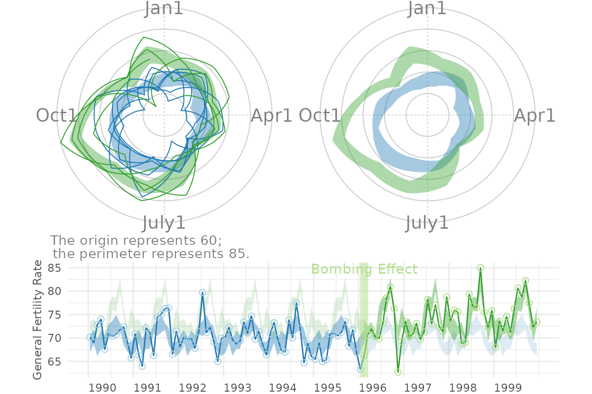

# Figures for the MBR Manuscript

This vignette produces the graphs included in the initial MBR
manuscript.

## Figure 1: Cartesian Rolling - 2005 Version

Figure 1: Raw monthly birth rates (General Fertility Rates; GFRs) for
Oklahoma County, 1990-1999, plotted in a linear plot; the “bombing
effect” is located ten months after the Oklahoma City bombing.


## Figure 2: Cartesian Rolling - 2014 Version

Smoothed monthly birth rates (General Fertility Rates; GFRs) for
Oklahoma County, 1990-1999, plotted in a linear plot. The top plot shows
the connected raw data with a February smoother; the middle plot shows
smoothing with a 12-month moving average, blue/green line, superimposed
on a February smoother, red line); the bottom plot shows the smoothers
and confidence bands, which are H-spreads defined using the distribution
of GFRs for the given month and 11 previous months.

First, some R packages are loaded, and some variables and functions are
defined.

``` r
change_month <- base::as.Date("1996-02-15") #as.Date("1995-04-19") + lubridate::weeks(39) = "1996-01-17"
set.seed(444) # So bootstrap won't trigger a git diff

vp_layout <- function(x, y) {
  grid::viewport(layout.pos.row = x, layout.pos.col = y)
}
full_spread <- function(scores) {
  base::range(scores) # A new function isn't necessary.  It's defined in order to be consistent.
}
h_spread <- function(scores) {
  stats::quantile(x = scores, probs = c(.25, .75))
}
se_spread <- function(scores) {
  base::mean(scores) + base::c(-1, 1) * stats::sd(scores) / base::sqrt(base::sum(!base::is.na(scores)))
}
boot_spread <- function(scores, conf = .68) {
  plugin <- function(d, i) {
    base::mean(d[i])
  }

  distribution <- boot::boot(data = scores, plugin, R = 99) # 999 for the publication
  ci <- boot::boot.ci(distribution, type = c("bca"), conf = conf)
  ci$bca[4:5] # The fourth & fifth elements correspond to the lower & upper bound.
}

dark_theme <- ggplot2::theme(
  axis.title          = ggplot2::element_text(color = "gray30", size = 9),
  axis.text.x         = ggplot2::element_text(color = "gray30", hjust = 0),
  axis.text.y         = ggplot2::element_text(color = "gray30"),
  axis.ticks          = ggplot2::element_blank(),
  # panel.grid.minor.y  = element_line(color = "gray95", linewidth = .1),
  # panel.grid.major    = element_line(color = "gray90", linewidth = .1),
  panel.spacing       = grid::unit(c(0, 0, 0, 0), "cm"),
  plot.margin         = grid::unit(c(0, 0, 0, 0), "cm")
)
# qplot(mtcars$hp) + dark_theme

light_theme <-
  dark_theme +
  ggplot2::theme(
    axis.title          = ggplot2::element_text(color = "gray80", size = 9),
    axis.text.x         = ggplot2::element_text(color = "gray80", hjust = 0),
    axis.text.y         = ggplot2::element_text(color = "gray80"),
    panel.grid.minor.y  = ggplot2::element_line(color = "gray99", linewidth = .1),
    panel.grid.major    = ggplot2::element_line(color = "gray95", linewidth = .1)
  )
date_sequence <-
  base::seq.Date(
    from = base::as.Date("1990-01-01"),
    to   = base::as.Date("1999-01-01"),
    by   = "years"
  )
x_scale <-
  ggplot2::scale_x_date(
    breaks = date_sequence,
    labels = scales::date_format("%Y")
  )
# This keeps things proportional down the three frames.
x_scale_blank <-
  ggplot2::scale_x_date(
    breaks = date_sequence,
    labels = NULL
  )
```

### Individual Components

Here is the basic linear rolling graph. It doesn’t require much
specification, and will work with a wide range of appropriate datasets.
This first (unpublished) graph displays all components.

``` r
# Uncomment the next two lines to use the version built into the package.  By default, it uses the
# CSV to promote reproducible research, since the CSV format is more open and accessible to more software.

ds_linear_all <-
  county_month_birth_rate_2005_version |>
  tibble::as_tibble()

ds_linear_okc <-
  ds_linear_all |>
  dplyr::filter(county_name == "oklahoma") |>
  augment_year_data_with_month_resolution(date_name = "date")

portfolio_cartesian <-
  annotate_data(
    ds_linear_okc,
    dv_name         = "birth_rate",
    center_function = stats::median,
    spread_function = h_spread
  )

cartesian_rolling(
  ds_linear           = portfolio_cartesian$ds_linear,
  x_name              = "date",
  y_name              = "birth_rate",
  stage_id_name       = "stage_id",
  change_points       = change_month,
  change_point_labels = "Bombing Effect"
)
```

    Warning: 
[1m
[22m`aes_string()` was deprecated in ggplot2 3.0.0.
    
[36mℹ
[39m Please use tidy evaluation idioms with `aes()`.
    
[36mℹ
[39m See also `vignette("ggplot2-in-packages")` for more information.
    
[36mℹ
[39m The deprecated feature was likely used in the 
[34mWats
[39m package.
      Please report the issue at 
[3m
[34m<https://github.com/OuhscBbmc/Wats/issues>
[39m
[23m.
    
[90mThis warning is displayed once every 8 hours.
[39m
    
[90mCall `lifecycle::last_lifecycle_warnings()` to see where this warning was
[39m
    
[90mgenerated.
[39m

    Warning: 
[1m
[22mUsing `size` aesthetic for lines was deprecated in ggplot2 3.4.0.
    
[36mℹ
[39m Please use `linewidth` instead.
    
[36mℹ
[39m The deprecated feature was likely used in the 
[34mWats
[39m package.
      Please report the issue at 
[3m
[34m<https://github.com/OuhscBbmc/Wats/issues>
[39m
[23m.
    
[90mThis warning is displayed once every 8 hours.
[39m
    
[90mCall `lifecycle::last_lifecycle_warnings()` to see where this warning was
[39m
    
[90mgenerated.
[39m

    Warning in scale_x_date(): 
[1m
[22mA 
[34m<numeric>
[39m value was passed to a 
[32mDate
[39m scale.
    
[36mℹ
[39m The value was converted to a <Date> object.


The version for the manuscript was tweaked to take advantage of certain
features of the dataset. This is what it looks like when all three
stylized panels are combined.

``` r
top_panel <-
  Wats::cartesian_rolling(
    ds_linear             = portfolio_cartesian$ds_linear,
    x_name                = "date",
    y_name                = "birth_rate",
    stage_id_name         = "stage_id",
    change_points         = change_month,
    y_title               = "General Fertility Rate",
    change_point_labels   = "Bombing Effect",
    draw_rolling_band     = FALSE,
    draw_rolling_line     = FALSE
  )

middle_panel <-
  Wats::cartesian_rolling(
    ds_linear             = portfolio_cartesian$ds_linear,
    x_name                = "date",
    y_name                = "birth_rate",
    stage_id_name         = "stage_id",
    change_points         = change_month,
    y_title               = "General Fertility Rate",
    change_point_labels   = "",
    draw_rolling_band     = FALSE,
    draw_jagged_line      = FALSE
  )

bottom_panel <-
  Wats::cartesian_rolling(
    ds_linear             = portfolio_cartesian$ds_linear,
    x_name                = "date",
    y_name                = "birth_rate",
    stage_id_name         = "stage_id",
    change_points         = change_month,
    y_title               = "General Fertility Rate",
    change_point_labels   = "",
    # draw_rolling_band   = FALSE,
    draw_jagged_line      = FALSE
  )

top_panel    <- top_panel    + x_scale       + dark_theme
middle_panel <- middle_panel + x_scale       + dark_theme
bottom_panel <- bottom_panel + x_scale_blank + dark_theme

grid::grid.newpage()
grid::pushViewport(grid::viewport(layout = grid::grid.layout(3,1)))
print(top_panel   , vp = vp_layout(1, 1))
```

    Warning in ggplot2::scale_x_date(breaks = date_sequence, labels = scales::date_format("%Y")): 
[1m
[22mA 
[34m<numeric>
[39m value was passed to a 
[32mDate
[39m scale.
    
[36mℹ
[39m The value was converted to a <Date> object.

``` r
print(middle_panel, vp = vp_layout(2, 1))
```

    Warning in ggplot2::scale_x_date(breaks = date_sequence, labels = scales::date_format("%Y")): 
[1m
[22mA 
[34m<numeric>
[39m value was passed to a 
[32mDate
[39m scale.
    
[36mℹ
[39m The value was converted to a <Date> object.

``` r
print(bottom_panel, vp = vp_layout(3, 1))
```

    Warning in ggplot2::scale_x_date(breaks = date_sequence, labels = NULL): 
[1m
[22mA 
[34m<numeric>
[39m value was passed to a 
[32mDate
[39m scale.
    
[36mℹ
[39m The value was converted to a <Date> object.

``` r
grid::popViewport()
```


## Figure 4: Cartesian Periodic

Cartesian plot of the GFR time series data in Oklahoma County, with
H-spread Bands superimposed.

``` r
cartesian_periodic <-
  Wats::cartesian_periodic(
    portfolio_cartesian$ds_linear,
    portfolio_cartesian$ds_periodic,
    x_name                  = "date",
    y_name                  = "birth_rate",
    stage_id_name           = "stage_id",
    change_points           = change_month,
    change_point_labels     = "Bombing Effect",
    y_title                 = "General Fertility Rate",
    draw_periodic_band      = TRUE #The only difference from the simple linear graph above
  )
print(cartesian_periodic)
```

    Warning in scale_x_date(): 
[1m
[22mA 
[34m<numeric>
[39m value was passed to a 
[32mDate
[39m scale.
    
[36mℹ
[39m The value was converted to a <Date> object.


``` r
cartesian_periodic <- cartesian_periodic + x_scale + dark_theme
print(cartesian_periodic)
```

    Warning in ggplot2::scale_x_date(breaks = date_sequence, labels = scales::date_format("%Y")): 
[1m
[22mA 
[34m<numeric>
[39m value was passed to a 
[32mDate
[39m scale.
    
[36mℹ
[39m The value was converted to a <Date> object.


## Figure 5: Polar Periodic

Wrap Around Time Series (WATS Plot) of the Oklahoma City GFR data,
1990-1999.

``` r
portfolio_polar <-
  polarize_cartesian(
    ds_linear                       = portfolio_cartesian$ds_linear,
    ds_stage_cycle                  = portfolio_cartesian$ds_stage_cycle,
    y_name                          = "birth_rate",
    stage_id_name                   = "stage_id",
    plotted_point_count_per_cycle   = 7200
  )

grid::grid.newpage()
polar_periodic(
  ds_linear             = portfolio_polar$ds_observed_polar,
  ds_stage_cycle        = portfolio_polar$ds_stage_cycle_polar,
  y_name                = "radius",
  stage_id_name         = "stage_id",
  draw_periodic_band    = FALSE,
  draw_stage_labels     = TRUE,
  draw_radius_labels    = TRUE,
  cardinal_labels       = c("Jan1", "Apr1", "July1", "Oct1")
)
```


## Figure 6: WATS and Cartesian

Wrap Around Time Series (WATS Plot) of the Oklahoma City GFR data,
1990-1999.

``` r
portfolio_polar <-
  Wats::polarize_cartesian(
    ds_linear                     = portfolio_cartesian$ds_linear,
    ds_stage_cycle                = portfolio_cartesian$ds_stage_cycle,
    y_name                        = "birth_rate",
    stage_id_name                 = "stage_id",
    plotted_point_count_per_cycle = 7200
  )

grid::grid.newpage()
grid::pushViewport(grid::viewport(
  layout = grid::grid.layout(
    nrow    = 2,
    ncol    = 2,
    respect = TRUE,
    widths  = grid::unit(c(1,  1), c("null", "null")),
    heights = grid::unit(c(1, .5), c("null", "null"))
  ),
  gp = grid::gpar(cex = 1, fill = NA)
))

## Create top left panel
grid::pushViewport(grid::viewport(layout.pos.col = 1, layout.pos.row = 1))
top_left_panel <-
  Wats::polar_periodic(
    ds_linear             = portfolio_polar$ds_observed_polar,
    ds_stage_cycle_polar  = portfolio_polar$ds_stage_cycle_polar,
    y_name                = "radius",
    stage_id_name         = "stage_id", #graph_ceiling = 7,
    cardinal_labels       = c("Jan1", "Apr1", "July1", "Oct1")
  )
grid::upViewport()

## Create top right panel
grid::pushViewport(grid::viewport(layout.pos.col = 2, layout.pos.row = 1))
top_right_panel <-
  Wats::polar_periodic(
  ds_linear             = portfolio_polar$ds_observed_polar,
  ds_stage_cycle_polar  = portfolio_polar$ds_stage_cycle_polar,
  y_name                = "radius",
  stage_id_name         = "stage_id", #graph_ceiling = 7,
  draw_observed_line    = FALSE,
  cardinal_labels       = c("Jan1", "Apr1", "July1", "Oct1"),
  origin_label          = NULL
)
grid::upViewport()

## Create bottom panel
grid::pushViewport(grid::viewport(layout.pos.col = 1:2, layout.pos.row = 2, gp = grid::gpar(cex = 1)))
print(cartesian_periodic, vp = vp_layout(x = 1:2, y = 2)) # Print across both columns of the bottom row.
```

    Warning in ggplot2::scale_x_date(breaks = date_sequence, labels = scales::date_format("%Y")): 
[1m
[22mA 
[34m<numeric>
[39m value was passed to a 
[32mDate
[39m scale.
    
[36mℹ
[39m The value was converted to a <Date> object.

``` r
grid::upViewport()
```



## Figure 7: County Comparison

This figure compares Oklahoma County against the (other) largest urban
counties.

``` r
# ds_linear_all <- Wats::augment_year_data_with_month_resolution(ds_linear = county_month_birth_rate_2005_version, date_name="date")

# Identify the average size of the fecund population
ds_linear_all |>
  dplyr::group_by(county_name) |>
  dplyr::summarize(
    Mean = base::mean(fecund_population)
  ) |>
  dplyr::ungroup()
```

    
[38;5;246m# A tibble: 12 × 2
[39m
       county_name     Mean
       
[3m
[38;5;246m<chr>
[39m
[23m          
[3m
[38;5;246m<dbl>
[39m
[23m
    
[38;5;250m 1
[39m canadian      
[4m1
[24m
[4m8
[24m332.
    
[38;5;250m 2
[39m cleveland     
[4m4
[24m
[4m8
[24m865.
    
[38;5;250m 3
[39m comanche      
[4m2
[24m
[4m6
[24m268.
    
[38;5;250m 4
[39m creek         
[4m1
[24m
[4m3
[24m402.
    
[38;5;250m 5
[39m logan          
[4m7
[24m065.
    
[38;5;250m 6
[39m mcclain        
[4m5
[24m434.
    
[38;5;250m 7
[39m oklahoma     
[4m1
[24m
[4m4
[24m
[4m6
[24m882.
    
[38;5;250m 8
[39m osage          
[4m8
[24m529.
    
[38;5;250m 9
[39m pottawatomie  
[4m1
[24m
[4m3
[24m604.
    
[38;5;250m10
[39m rogers        
[4m1
[24m
[4m3
[24m383.
    
[38;5;250m11
[39m tulsa        
[4m1
[24m
[4m2
[24m
[4m3
[24m783.
    
[38;5;250m12
[39m wagoner       
[4m1
[24m
[4m1
[24m580.

``` r
graph_row_comparison <- function(
    row_label       = "",
    .county_name    = "oklahoma",
    spread_function = h_spread,
    change_month    = as.Date("1996-02-15")
) {
  ds_linear <-
    ds_linear_all |>
    dplyr::filter(county_name == .county_name) |>
    Wats::augment_year_data_with_month_resolution(date_name = "date")

  portfolio_cartesian <-
    ds_linear |>
    Wats::annotate_data(
      dv_name         = "birth_rate",
      center_function = stats::median,
      spread_function = spread_function
    )

  portfolio_polar <-
    portfolio_cartesian$ds_linear |>
    Wats::polarize_cartesian(
      ds_stage_cycle                = portfolio_cartesian$ds_stage_cycle,
      y_name                        = "birth_rate",
      stage_id_name                 = "stage_id",
      plotted_point_count_per_cycle = 7200
    )

  cartesian_periodic <-
    portfolio_cartesian$ds_linear |>
    Wats::cartesian_periodic(
      portfolio_cartesian$ds_periodic,
      x_name                            = "date",
      y_name                            = "birth_rate",
      stage_id_name                     = "stage_id",
      change_points                     = change_month,
      change_point_labels               = ""
  )

  grid::pushViewport(grid::viewport(
    layout =
      grid::grid.layout(
        nrow    = 1,
        ncol    = 3,
        respect = FALSE,
        widths  = grid::unit(c(1.5, 1, 3), c("line", "null", "null"))
      ),
    gp = grid::gpar(cex = 1, fill = NA)
  ))

  grid::pushViewport(grid::viewport(layout.pos.col = 1))
  grid::grid.rect(gp = grid::gpar(fill = "gray90", col = NA))
  grid::grid.text(row_label, rot = 90)
  grid::popViewport()

  grid::pushViewport(grid::viewport(layout.pos.col = 2))
  Wats::polar_periodic(
    ds_linear               = portfolio_polar$ds_observed_polar,
    ds_stage_cycle_polar    = portfolio_polar$ds_stage_cycle_polar,
    draw_observed_line      = FALSE,
    y_name                  = "radius",
    stage_id_name           = "stage_id",
    origin_label            = NULL,
    plot_margins            = c(0, 0, 0, 0)
  )
  grid::popViewport()

  grid::pushViewport(grid::viewport(layout.pos.col = 3))
  print(cartesian_periodic + x_scale + light_theme, vp = vp_layout(x = 1, y = 1))
  grid::popViewport()
  grid::popViewport() #Finish the row
}

county_names  <- c("Comanche", "Cleveland", "Oklahoma", "Tulsa", "Rogers")
counties      <- tolower(county_names)

grid::grid.newpage()
grid::pushViewport(grid::viewport(
  layout  = grid::grid.layout(nrow = length(counties), ncol = 1),
  gp      = grid::gpar(cex = 1, fill = NA)
))

for (i in base::seq_along(counties)) {
  grid::pushViewport(grid::viewport(layout.pos.row = i))
  graph_row_comparison(.county_name = counties[i], row_label = county_names[i])
  grid::popViewport()
}
```

    Warning in ggplot2::scale_x_date(breaks = date_sequence, labels = scales::date_format("%Y")): 
[1m
[22mA 
[34m<numeric>
[39m value was passed to a 
[32mDate
[39m scale.
    
[36mℹ
[39m The value was converted to a <Date> object.
    
[1m
[22mA 
[34m<numeric>
[39m value was passed to a 
[32mDate
[39m scale.
    
[36mℹ
[39m The value was converted to a <Date> object.
    
[1m
[22mA 
[34m<numeric>
[39m value was passed to a 
[32mDate
[39m scale.
    
[36mℹ
[39m The value was converted to a <Date> object.
    
[1m
[22mA 
[34m<numeric>
[39m value was passed to a 
[32mDate
[39m scale.
    
[36mℹ
[39m The value was converted to a <Date> object.
    
[1m
[22mA 
[34m<numeric>
[39m value was passed to a 
[32mDate
[39m scale.
    
[36mℹ
[39m The value was converted to a <Date> object.

``` r
grid::popViewport()
```


Here are all 12 counties that Ronnie collected birth records for. This
extended graph is not in the manuscript.

``` r
counties <- base::sort(base::unique(ds_linear_all$county_name))
county_names <- c("Canadian", "Cleveland", "Comanche", "Creek", "Logan", "McClain", "Oklahoma", "Osage", "Pottawatomie", "Rogers", "Tulsa", "Wagoner")

grid::grid.newpage()
grid::pushViewport(grid::viewport(
  layout  = grid::grid.layout(nrow = base::length(counties), ncol = 1),
  gp      = grid::gpar(cex = 1, fill = NA)
))

for (i in base::seq_along(counties)) {
  grid::pushViewport(grid::viewport(layout.pos.row = i))
  graph_row_comparison(.county_name = counties[i], row_label = county_names[i])
  grid::popViewport()
}
```

    Warning in ggplot2::scale_x_date(breaks = date_sequence, labels = scales::date_format("%Y")): 
[1m
[22mA 
[34m<numeric>
[39m value was passed to a 
[32mDate
[39m scale.
    
[36mℹ
[39m The value was converted to a <Date> object.
    
[1m
[22mA 
[34m<numeric>
[39m value was passed to a 
[32mDate
[39m scale.
    
[36mℹ
[39m The value was converted to a <Date> object.
    
[1m
[22mA 
[34m<numeric>
[39m value was passed to a 
[32mDate
[39m scale.
    
[36mℹ
[39m The value was converted to a <Date> object.
    
[1m
[22mA 
[34m<numeric>
[39m value was passed to a 
[32mDate
[39m scale.
    
[36mℹ
[39m The value was converted to a <Date> object.
    
[1m
[22mA 
[34m<numeric>
[39m value was passed to a 
[32mDate
[39m scale.
    
[36mℹ
[39m The value was converted to a <Date> object.
    
[1m
[22mA 
[34m<numeric>
[39m value was passed to a 
[32mDate
[39m scale.
    
[36mℹ
[39m The value was converted to a <Date> object.
    
[1m
[22mA 
[34m<numeric>
[39m value was passed to a 
[32mDate
[39m scale.
    
[36mℹ
[39m The value was converted to a <Date> object.
    
[1m
[22mA 
[34m<numeric>
[39m value was passed to a 
[32mDate
[39m scale.
    
[36mℹ
[39m The value was converted to a <Date> object.
    
[1m
[22mA 
[34m<numeric>
[39m value was passed to a 
[32mDate
[39m scale.
    
[36mℹ
[39m The value was converted to a <Date> object.
    
[1m
[22mA 
[34m<numeric>
[39m value was passed to a 
[32mDate
[39m scale.
    
[36mℹ
[39m The value was converted to a <Date> object.
    
[1m
[22mA 
[34m<numeric>
[39m value was passed to a 
[32mDate
[39m scale.
    
[36mℹ
[39m The value was converted to a <Date> object.
    
[1m
[22mA 
[34m<numeric>
[39m value was passed to a 
[32mDate
[39m scale.
    
[36mℹ
[39m The value was converted to a <Date> object.

``` r
grid::popViewport()
```


## Figure 8: Error Band Comparison

This figure demonstrates that WATS accommodates many types of error
bands.

``` r
spreads <- c("h_spread", "full_spread", "se_spread", "boot_spread")
spread_names <- c("H-Spread", "Range", "+/-1 SE", "Bootstrap")
grid::grid.newpage()
grid::pushViewport(grid::viewport(
  layout  = grid::grid.layout(nrow = base::length(spreads), ncol = 1),
  gp      = grid::gpar(cex = 1, fill = NA)
))
for (i in base::seq_along(spreads)) {
  grid::pushViewport(grid::viewport(layout.pos.row = i))
  graph_row_comparison(spread_function = base::get(spreads[i]), row_label = spread_names[i])
  grid::upViewport()
}
```

    Warning in ggplot2::scale_x_date(breaks = date_sequence, labels = scales::date_format("%Y")): 
[1m
[22mA 
[34m<numeric>
[39m value was passed to a 
[32mDate
[39m scale.
    
[36mℹ
[39m The value was converted to a <Date> object.
    
[1m
[22mA 
[34m<numeric>
[39m value was passed to a 
[32mDate
[39m scale.
    
[36mℹ
[39m The value was converted to a <Date> object.
    
[1m
[22mA 
[34m<numeric>
[39m value was passed to a 
[32mDate
[39m scale.
    
[36mℹ
[39m The value was converted to a <Date> object.
    
[1m
[22mA 
[34m<numeric>
[39m value was passed to a 
[32mDate
[39m scale.
    
[36mℹ
[39m The value was converted to a <Date> object.

``` r
grid::upViewport()
```


## Session Info

The current vignette was build on a system using the following software.

    Report created by runner at Mon Nov 24 17:13:40 2025, +0000

    R version 4.5.2 (2025-10-31)
    Platform: x86_64-pc-linux-gnu
    Running under: Ubuntu 24.04.3 LTS

    Matrix products: default
    BLAS:   /usr/lib/x86_64-linux-gnu/openblas-pthread/libblas.so.3 
    LAPACK: /usr/lib/x86_64-linux-gnu/openblas-pthread/libopenblasp-r0.3.26.so;  LAPACK version 3.12.0

    locale:
     [1] LC_CTYPE=C.UTF-8       LC_NUMERIC=C           LC_TIME=C.UTF-8       
     [4] LC_COLLATE=C.UTF-8     LC_MONETARY=C.UTF-8    LC_MESSAGES=C.UTF-8   
     [7] LC_PAPER=C.UTF-8       LC_NAME=C              LC_ADDRESS=C          
    [10] LC_TELEPHONE=C         LC_MEASUREMENT=C.UTF-8 LC_IDENTIFICATION=C   

    time zone: UTC
    tzcode source: system (glibc)

    attached base packages:
    [1] stats     graphics  grDevices utils     datasets  methods   base     

    other attached packages:
    [1] Wats_1.0.1.9000

    loaded via a namespace (and not attached):
     [1] gtable_0.3.6       jsonlite_2.0.0     crayon_1.5.3       dplyr_1.1.4       
     [5] compiler_4.5.2     tidyselect_1.2.1   jquerylib_0.1.4    systemfonts_1.3.1 
     [9] scales_1.4.0       textshaping_1.0.4  testit_0.13        boot_1.3-32       
    [13] yaml_2.3.10        fastmap_1.2.0      lattice_0.22-7     ggplot2_4.0.1     
    [17] R6_2.6.1           labeling_0.4.3     generics_0.1.4     knitr_1.50        
    [21] htmlwidgets_1.6.4  tibble_3.3.0       desc_1.4.3         lubridate_1.9.4   
    [25] bslib_0.9.0        pillar_1.11.1      RColorBrewer_1.1-3 rlang_1.1.6       
    [29] utf8_1.2.6         cachem_1.1.0       xfun_0.54          fs_1.6.6          
    [33] sass_0.4.10        S7_0.2.1           timechange_0.3.0   cli_3.6.5         
    [37] withr_3.0.2        pkgdown_2.2.0      magrittr_2.0.4     digest_0.6.39     
    [41] grid_4.5.2         lifecycle_1.0.4    vctrs_0.6.5        evaluate_1.0.5    
    [45] glue_1.8.0         farver_2.1.2       zoo_1.8-14         ragg_1.5.0        
    [49] rmarkdown_2.30     tools_4.5.2        pkgconfig_2.0.3    htmltools_0.5.8.1 
