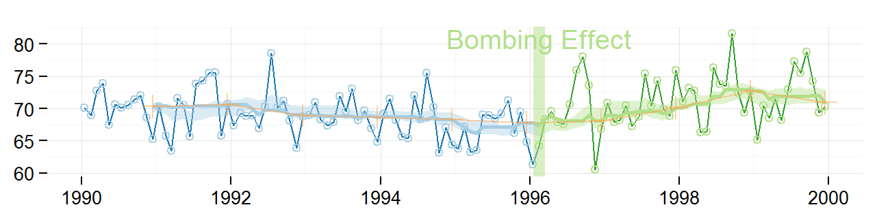
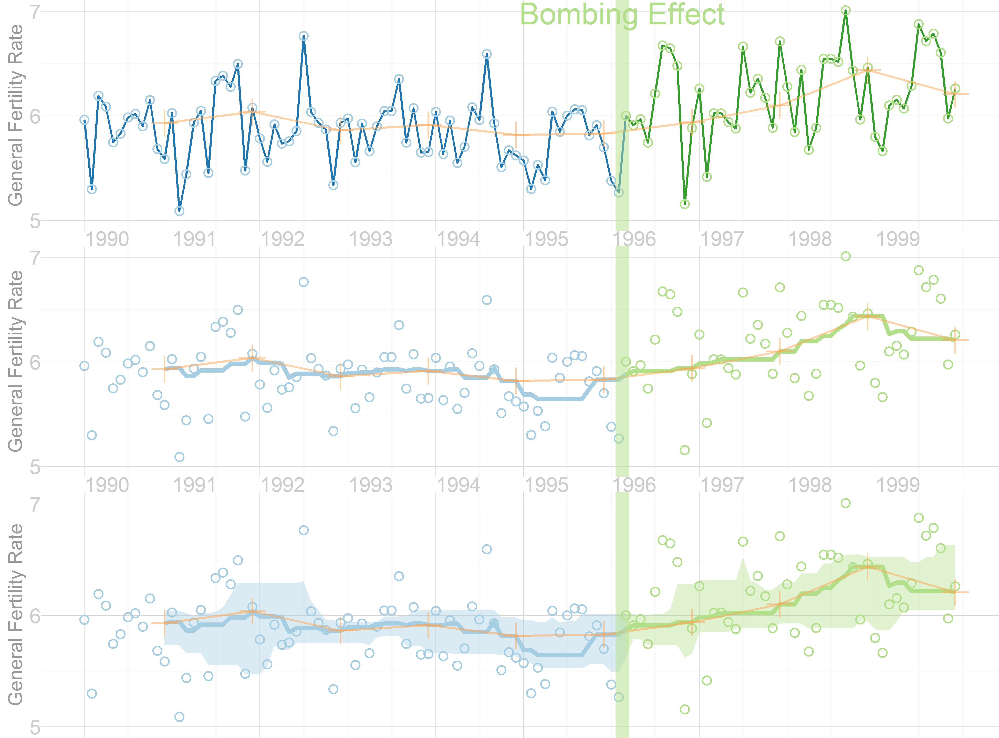
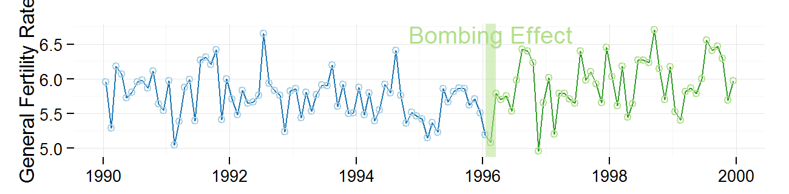
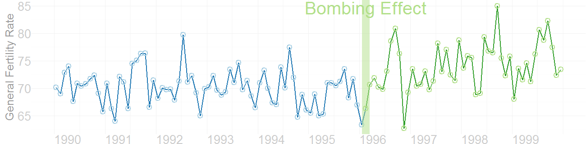
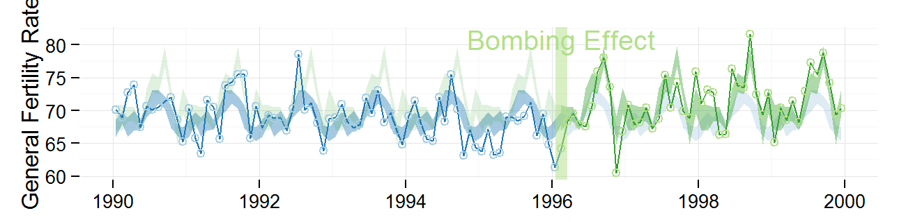
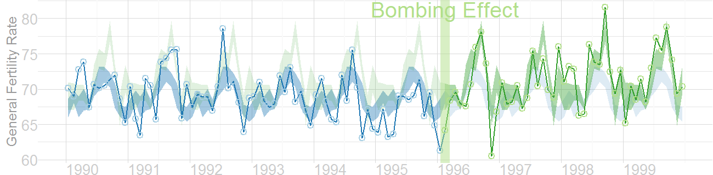
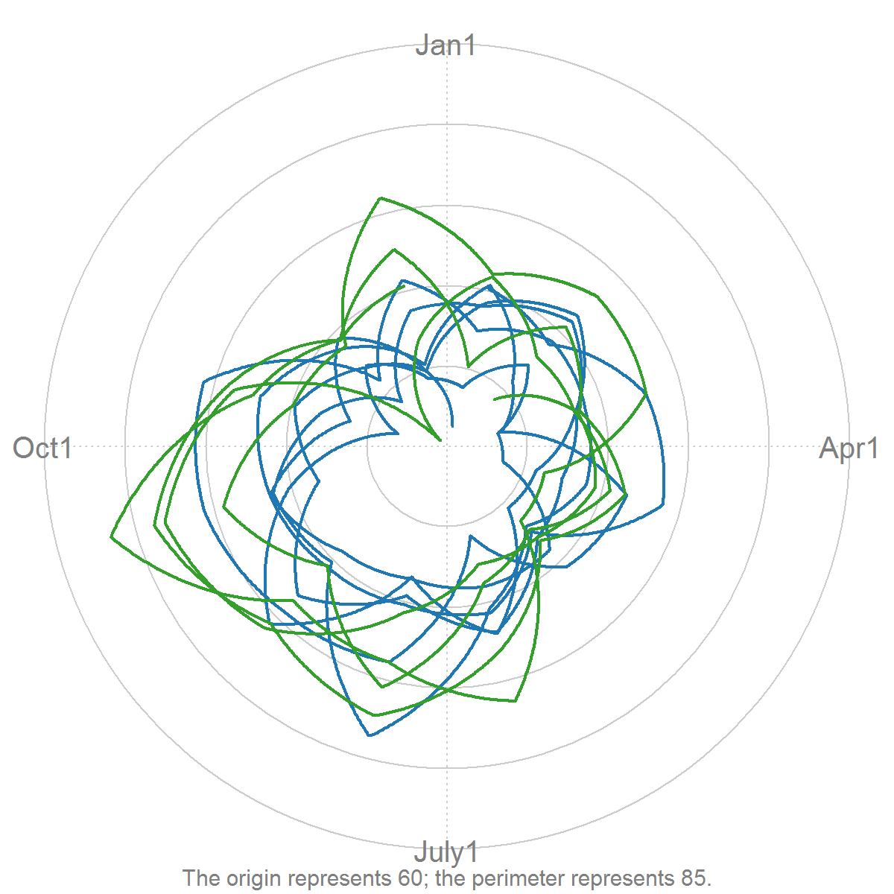
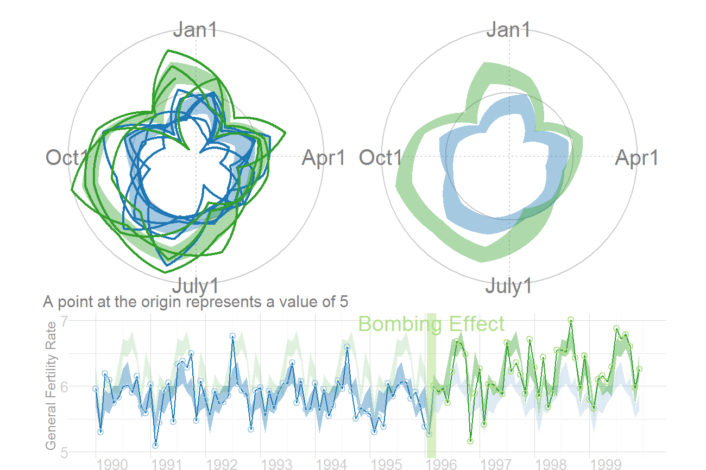
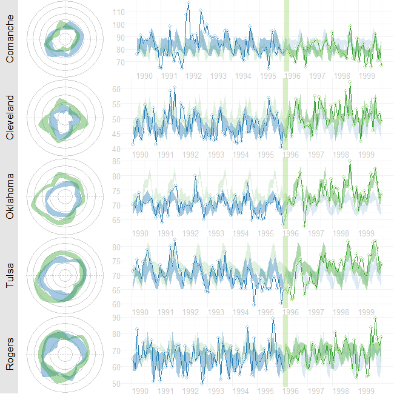
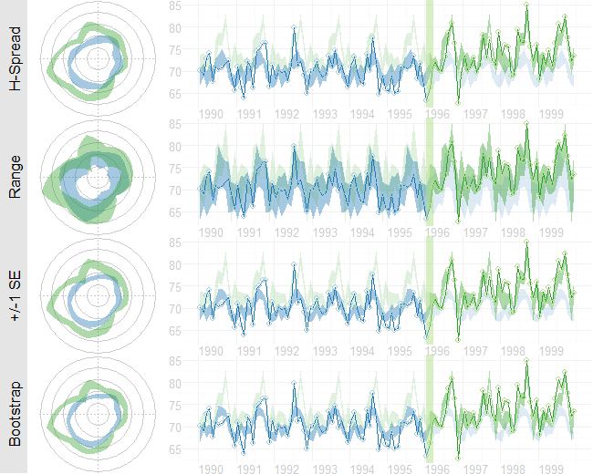

<!--
%\VignetteEngine{knitr::knitr}
%\VignetteIndexEntry{Figures for the MBR Manuscript}
-->

# Figures for the MBR Manuscript
This vignette produces the graphs included in the initial MBR manuscript.


## Figure 2: Cartesian Rolling
Smoothed monthly birth rates (General Fertility Rates; GFRs) for Oklahoma County, 1990-1999, plotted in a linear plot.  The top plot shows the connected raw data with a February smoother; the middle plot shows smoothing with a 12-month moving average, blue/green line, superimposed on a February smoother, red line); the bottom plot shows the smoothers and confidence bands, which are H-spreads defined using the distribution of GFR's for the given month and 11 previous months.

First, some R packages are loaded, and some variables and functions are defined.

```r
library(Wats)
library(grid)
library(plyr) 
library(ggplot2) 
library(boot) 

changeMonth <- as.Date("1996-02-15") #as.Date("1995-04-19") + lubridate::weeks(39) = "1996-01-17"

vpLayout <- function(x, y) { viewport(layout.pos.row=x, layout.pos.col=y) }

fullSpread <- function( scores) { 
  return( range(scores) ) #A new function isn't necessary.  It's defined in order to be consistent.
}
hSpread <- function( scores) { 
  return( quantile(x=scores, probs=c(.25, .75)) ) 
}
seSpread <- function( scores) { 
  return( mean(scores) + c(-1, 1) * sd(scores) / sqrt(length(scores)) ) 
}
bootSpread <- function( scores, conf=.66 ) {
  plugin <- function( d, i ) { mean(d[i]) }

  dist <- boot(data=scores, plugin, R=99) #999 for the publication
  ci <- boot.ci(dist, type = c("bca"), conf=conf)
  return( ci$bca[4:5] ) #The fourth & fifth elements correspond to the lower & upper bound.
}
```


### Individual Components
Here is the basic linear rolling graph.  It doesn't require much specification, and will work with a wide range of approriate datasets.  This first (unpublished) graph displays all components.


```r
dsLinear <- CountyMonthBirthRate2005Version[CountyMonthBirthRate2005Version$CountyName=="oklahoma", ]

dsLinear <- AugmentYearDataWithMonthResolution(dsLinear=dsLinear, dateName="Date")

portfolioCartesian <- AnnotateData(dsLinear, dvName="BirthRate", centerFunction=median, spreadFunction=hSpread)

CartesianRolling(
  dsLinear = portfolioCartesian$dsLinear, 
  xName = "Date", 
  yName = "BirthRate", 
  stageIDName = "StageID", 
  changePoints = changeMonth, 
  changePointLabels = "Bombing Effect"
)
```

```
Warning: Removed 11 rows containing missing values (geom_path).
```

 


The version for the manuscript was tweaked to take advantage of certain features of the dataset.


```r
darkTheme <- ggplot2::theme(
  axis.title          = element_text(color="gray40", size=9),
  axis.text.x         = element_text(color="gray40", hjust=0),
  axis.text.y         = element_text(color="gray40"),
  axis.ticks.length   = grid::unit(0, "cm"),
  axis.ticks.margin   = grid::unit(.00001, "cm"),
  panel.grid.minor.y  = element_line(color="gray99", size=.1),
  panel.grid.major    = element_line(color="gray95", size=.1),
  panel.margin        = grid::unit(c(0, 0, 0, 0), "cm"),
  plot.margin         = grid::unit(c(0, 0, 0, 0), "cm")
)
lightTheme <- darkTheme + ggplot2::theme(
  axis.title          = element_text(color="gray80", size=9),
  axis.text.x         = element_text(color="gray80", hjust=0),
  axis.text.y         = element_text(color="gray80")
)
dateSequence <- seq.Date(from=as.Date("1990-01-01"), to=as.Date("1999-01-01"), by="years")
xScale       <- scale_x_date(breaks=dateSequence, labels=scales::date_format("%Y"))
xScaleBlank  <- scale_x_date(breaks=dateSequence, labels=NULL) #This keeps things proportional down the three frames.

topPanel <- CartesianRolling(
  dsLinear = portfolioCartesian$dsLinear, 
  xName = "Date", 
  yName = "BirthRate", 
  stageIDName = "StageID", 
  changePoints = changeMonth, 
  yTitle = "General Fertility Rate",
  changePointLabels = "Bombing Effect", 
  drawRollingBand = FALSE, 
  drawRollingLine = FALSE
)

middlePanel <- CartesianRolling(
  dsLinear = portfolioCartesian$dsLinear, 
  xName = "Date", 
  yName = "BirthRate", 
  stageIDName = "StageID", 
  changePoints = changeMonth, 
  yTitle = "General Fertility Rate",
  changePointLabels = "", 
  drawRollingBand = FALSE, 
  drawJaggedLine = FALSE
)

bottomPanel <- CartesianRolling(
  dsLinear = portfolioCartesian$dsLinear, 
  xName = "Date", 
  yName = "BirthRate", 
  stageIDName = "StageID", 
  changePoints = changeMonth, 
  yTitle = "General Fertility Rate", 
  changePointLabels = "", 
  drawJaggedLine = FALSE
)

topPanel <- topPanel + xScale + darkTheme
middlePanel <- middlePanel + xScale + darkTheme
bottomPanel <- bottomPanel + xScaleBlank + darkTheme
```


### Combined Panels
This is what it looks like when all three stylized panels are combined.


```r
#out.height=4.8, out.width=6.5,
vpLayout <- function(x, y) { viewport(layout.pos.row=x, layout.pos.col=y) }
grid.newpage()
pushViewport(viewport(layout=grid.layout(3,1)))
print(topPanel, vp=vpLayout(1, 1))
print(middlePanel, vp=vpLayout(2, 1))
```

```
Warning: Removed 11 rows containing missing values (geom_path).
```

```r
print(bottomPanel, vp=vpLayout(3, 1))
```

```
Warning: Removed 11 rows containing missing values (geom_path).
```

```r
popViewport()
```

 


## Figure 4: Carteisan Rolling
Re-portrayal of the linear plot of the GFR time series in Oklahoma County.  This will probably be cut from the manuscript.  But here is the basic & tweaked version.


```r
cartesianPeriodicSimple <- CartesianPeriodic(
  portfolioCartesian$dsLinear, 
  portfolioCartesian$dsPeriodic, 
  xName = "Date", 
  yName = "BirthRate",
  stageIDName = "StageID", 
  changePoints = changeMonth, 
  changePointLabels = "Bombing Effect",
  yTitle = "General Fertility Rate",
  drawPeriodicBand = FALSE
)
print(cartesianPeriodicSimple) #`print()` isn't necessary, but it makes my intention a little clearer.
```

 


```r
print(cartesianPeriodicSimple + xScale + darkTheme) 
```

 


## Figure 5: Carteisan Periodic 
Carteisan plot of the GFR time series data in Oklahoma County, with H-spread Bands superimposed.


```r
cartesianPeriodic <- CartesianPeriodic(
  portfolioCartesian$dsLinear, 
  portfolioCartesian$dsPeriodic, 
  xName = "Date", 
  yName = "BirthRate",
  stageIDName = "StageID", 
  changePoints = changeMonth, 
  changePointLabels = "Bombing Effect",
  yTitle = "General Fertility Rate",
  drawPeriodicBand = TRUE #The only difference from the simple linear graph above
)
print(cartesianPeriodic)
```

 


```r
cartesianPeriodic <- cartesianPeriodic + xScale + darkTheme 
print(cartesianPeriodic)
```

 


## Figure 6: Polar Periodic
Wrap Around Time Series (WATS Plot) of the Oklahoma City GFR data, 1990-1999


```r
portfolioPolar <- PolarizeCartesian( 
  dsLinear = portfolioCartesian$dsLinear, 
  dsStageCycle = portfolioCartesian$dsStageCycle, 
  yName = "BirthRate", 
  stageIDName = "StageID", 
  plottedPointCountPerCycle = 7200
)

windows.options(antialias = "cleartype")
grid.newpage()
PolarPeriodic(
  dsLinear = portfolioPolar$dsObservedPolar, 
  dsStageCycle = portfolioPolar$dsStageCyclePolar, 
  yName = "Radius",
  stageIDName = "StageID", 
  drawPeriodicBand = FALSE,
  cardinalLabels = c("Jan1", "Apr1", "July1", "Oct1")
)
```

 

## Figure 7: WATS and Cartesian
Wrap Around Time Series (WATS Plot) of the Oklahoma City GFR data, 1990-1999


```r
portfolioPolar <- PolarizeCartesian(
  dsLinear = portfolioCartesian$dsLinear, 
  dsStageCycle = portfolioCartesian$dsStageCycle, 
  yName = "BirthRate", 
  stageIDName = "StageID", 
  plottedPointCountPerCycle = 7200
)

grid.newpage()
pushViewport(viewport(
  layout=grid.layout(
    nrow = 2, ncol = 2, respect = TRUE, 
    widths = unit(c(1,1), c("null", "null")), 
    heights = unit(c(1,.5), c("null", "null"))
  ), 
  gp = gpar(cex=1, fill=NA)
))

## Create top left panel
pushViewport(viewport(layout.pos.col=1, layout.pos.row=1))
topLeftPanel <- PolarPeriodic(  
  dsLinear = portfolioPolar$dsObservedPolar, 
  dsStageCyclePolar = portfolioPolar$dsStageCyclePolar, 
  yName = "Radius", 
  stageIDName = "StageID", #graphCeiling=7, 
  cardinalLabels = c("Jan1", "Apr1", "July1", "Oct1")
)
upViewport()

## Create top right panel
pushViewport(viewport(layout.pos.col=2, layout.pos.row=1))
topRighttPanel <- PolarPeriodic(
  dsLinear = portfolioPolar$dsObservedPolar, 
  dsStageCyclePolar = portfolioPolar$dsStageCyclePolar, 
  yName = "Radius", 
  stageIDName = "StageID", #graphCeiling=7, 
  drawObservedLine = FALSE,
  cardinalLabels = c("Jan1", "Apr1", "July1", "Oct1"), 
  originLabel = NULL
)
upViewport()

## Create bottom panel
pushViewport(viewport(layout.pos.col=1:2, layout.pos.row=2, gp=gpar(cex=1)))
print(cartesianPeriodic, vp=vpLayout(x=1:2, y=2)) #Print across both columns of the bottom row.
upViewport()
```

 


## Figure 8: County Comparison
This figure compares Oklahoma County against the (other) largest urban counties.

```r
dsLinearAll <- AugmentYearDataWithMonthResolution(dsLinear=CountyMonthBirthRate2005Version, dateName="Date")

#Identify the average size of the fecund population
plyr::ddply(dsLinearAll, "CountyName", summarize, Mean=mean(FecundPopulation))
```

```
     CountyName   Mean
1      canadian  18333
2     cleveland  48865
3      comanche  26268
4         creek  13402
5         logan   7066
6       mcclain   5435
7      oklahoma 146883
8         osage   8530
9  pottawatomie  13604
10       rogers  13383
11        tulsa 123783
12      wagoner  11580
```

```r


GraphRowComparison <- function( rowLabel="", countyName="oklahoma", spreadFunction=hSpread, changeMonth=as.Date("1996-02-15") ) {
  dsLinear <- CountyMonthBirthRate2005Version[CountyMonthBirthRate2005Version$CountyName==countyName, ]
  dsLinear <- AugmentYearDataWithMonthResolution(dsLinear=dsLinear, dateName="Date")
  portfolioCartesian <- AnnotateData(dsLinear, dvName="BirthRate", centerFunction=median, spreadFunction=spreadFunction)
  portfolioPolar <- PolarizeCartesian(dsLinear=portfolioCartesian$dsLinear, dsStageCycle=portfolioCartesian$dsStageCycle, yName="BirthRate", stageIDName="StageID", plottedPointCountPerCycle=7200)
  cartesianPeriodic <- CartesianPeriodic(portfolioCartesian$dsLinear, portfolioCartesian$dsPeriodic, xName="Date", yName="BirthRate", stageIDName="StageID", changePoints=changeMonth, changePointLabels=""  )
  
  pushViewport(viewport(
    layout=grid.layout(nrow=1, ncol=3, respect=F, widths=unit(c(1.5,1,3), c("line", "null", "null"))), 
    gp=gpar(cex=1, fill=NA)
  ))
  pushViewport(viewport(layout.pos.col=1))
  grid.rect(gp=gpar(fill="gray90", col=NA))
  grid.text(rowLabel, rot=90)
  popViewport()
  
  pushViewport(viewport(layout.pos.col=2))
  polarPeriodic <- PolarPeriodic(dsLinear=portfolioPolar$dsObservedPolar, dsStageCyclePolar=portfolioPolar$dsStageCyclePolar, drawObservedLine=FALSE, yName="Radius", stageIDName="StageID", originLabel=NULL, plotMargins=c(0,0,0,0))
  popViewport()
  
  pushViewport(viewport(layout.pos.col=3))
  print(cartesianPeriodic + xScale + lightTheme, vp=vpLayout(x=1, y=1))
  popViewport()
  popViewport() #Finish the row
}

counties <- c("comanche", "cleveland", "oklahoma", "tulsa", "rogers")
countyNames <- c("Comanche", "Cleveland", "Oklahoma", "Tulsa", "Rogers")

grid.newpage()
pushViewport(viewport(layout=grid.layout(nrow=length(counties), ncol=1), gp=gpar(cex=1, fill=NA)))
for( i in seq_along(counties) ) {
  pushViewport(viewport(layout.pos.row=i))
  GraphRowComparison(countyName=counties[i], rowLabel=countyNames[i])
  popViewport()
}
popViewport()
```

 


Here are all 12 counties that Ronnie colelcted birth records for.

```r
counties <- sort(unique(CountyMonthBirthRate2005Version$CountyName))
countyNames <- c("Canadian", "Cleveland", "Comanche", "Creek", "Logan", "McClain", "Oklahoma", "Osage", "Pottawatomie", "Rogers", "Tulsa", "Wagoner")

grid.newpage()
pushViewport(viewport(layout=grid.layout(nrow=length(counties), ncol=1), gp=gpar(cex=1, fill=NA)))
for( i in seq_along(counties) ) {
  pushViewport(viewport(layout.pos.row=i))
  GraphRowComparison(countyName=counties[i], rowLabel=countyNames[i])
  popViewport()
}
popViewport()
```

 


## Figure 9: Error Band Comparison
This figure demonstrates that WATS accommodates many types of error bands.

```r
spreads <- c("hSpread", "fullSpread", "seSpread", "bootSpread")
spreadNames <- c("H-Spread", "Range", "+/-1 SE", "Bootstrap")
grid.newpage()
pushViewport(viewport(layout=grid.layout(nrow=length(spreads), ncol=1), gp=gpar(cex=1, fill=NA)))
for( i in seq_along(spreads) ) {
  pushViewport(viewport(layout.pos.row=i))
  GraphRowComparison(spreadFunction=get(spreads[i]), rowLabel=spreadNames[i])
  upViewport()
}
upViewport()
```

 


## Session Info
For the sake of documentation and reproducibility, the current vignette was build on a system using the following software.


```
Report created by Will at 12/25/2013 12:36:56 AM, Central Standard Time
```

```
R version 3.0.2 Patched (2013-12-17 r64473)
Platform: x86_64-w64-mingw32/x64 (64-bit)

locale:
[1] LC_COLLATE=English_United States.1252  LC_CTYPE=English_United States.1252    LC_MONETARY=English_United States.1252
[4] LC_NUMERIC=C                           LC_TIME=English_United States.1252    

attached base packages:
[1] grid      stats     graphics  grDevices utils     datasets  methods   base     

other attached packages:
[1] boot_1.3-9      ggplot2_0.9.3.1 plyr_1.8        Wats_0.2-1      knitr_1.5      

loaded via a namespace (and not attached):
 [1] colorspace_1.2-4   dichromat_2.0-0    digest_0.6.4       evaluate_0.5.1     formatR_0.10       gtable_0.1.2      
 [7] labeling_0.2       lattice_0.20-24    lubridate_1.3.2    MASS_7.3-29        memoise_0.1        munsell_0.4.2     
[13] proto_0.3-10       RColorBrewer_1.0-5 reshape2_1.2.2     scales_0.2.3       stringr_0.6.2      testit_0.3        
[19] tools_3.0.2        zoo_1.7-10        
```

