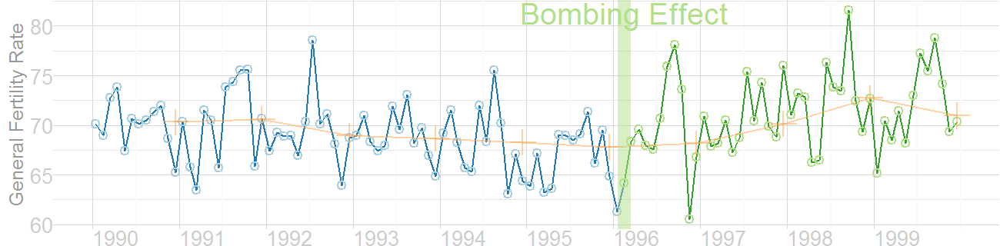
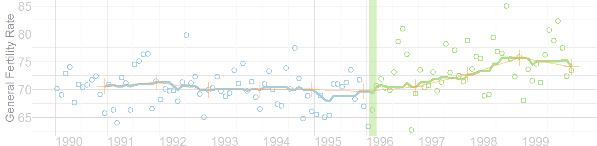
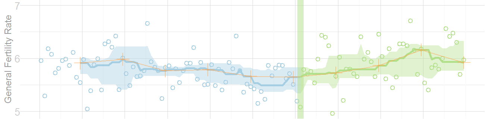

<!--
%\VignetteEngine{knitr::knitr}
%\VignetteIndexEntry{Figures for the MBR Manuscript}
-->

# Figures for the MBR Manuscript
This vignette produces the graphs included in the initial MBR manuscript.


## Figure 2: Rolling Linear
Smoothed monthly birth rates (General Fertility Rates; GFRs) for Oklahoma County, 1990-1999, plotted in a linear plot.  The top plot shows the connected raw data with a February smoother; the middle plot shows smoothing with a 12-month moving average, blue/green line, superimposed on a February smoother, red line); the bottom plot shows the smoothers and confidence bands, which are H-spreads defined using the distribution of GFR's for the given month and 11 previous months.

### Individual Components
Here is the basic linear rolling graph.  It doesn't require much specification, and will work with a wide range of approriate datasets.


```r
library(Wats)
library(grid)
library(ggplot2) 
library(boot) 
dsLinear <- CountyMonthBirthRate[CountyMonthBirthRate$CountyName=="oklahoma", ]
# filePathOutcomes <- file.path(devtools::inst(name="Wats"), "extdata", "BirthRatesOk.txt")
# dsLinear <- read.table(file=filePathOutcomes, header=TRUE, sep="\t", stringsAsFactors=F)
# dsLinear$Date <- as.Date(dsLinear$Date) 
# dsLinear$MonthID <- NULL
changeMonth <- as.Date("1996-02-15")
dsLinear <- AugmentYearDataWithMonthResolution(dsLinear=dsLinear, dateName="Date")
# base::pretty(x=dsLinear$BirthRate)

hSpread <- function( scores) { return( quantile(x=scores, probs=c(.25, .75)) ) }
seSpread <- function( scores) { return( mean(scores) + c(-1, 1)*sd(scores)/sqrt(length(scores)) ) }
bootSpread <- function( scores, conf=.66 ) {
  plugin <- function( d, i ) { mean(d[i]) }

  dist <- boot(data=scores, plugin, R=999)
  ci <- boot.ci(dist, type = c("bca"), conf=conf)
  return( ci$bca[4:5] )
}
# b <- bootSpread(dsLinear$BirthRate)

portfolioCartesian <- AnnotateData(dsLinear, dvName="BirthRate",centerFunction=median, 
                                   spreadFunction=bootSpread)
                                   #spreadFunction=seSpread)

CartesianRolling(dsLinear=portfolioCartesian$dsLinear, xName="Date", yName="BirthRate", stageIDName="StageID", changePoints=changeMonth, changePointLabels="Bombing Effect")
```

```
Warning: Removed 11 rows containing missing values (geom_path).
```

 


The version for the manuscript was tweak to take advantage of certain features of the dataset.


```r
fig2Theme <- ggplot2::theme(
  axis.title          = element_text(color="gray60", size=9),
  axis.text.x         = element_text(color="gray80", hjust=0),
  axis.text.y         = element_text(color="gray80"),
  axis.ticks.length   = grid::unit(0, "cm"), #g <- g + theme(axis.ticks=element_blank())
  axis.ticks.margin   = grid::unit(.00001, "cm"),
  panel.grid.minor.y  = element_line(color="gray90", size=.1),
  panel.grid.major    = element_line(color="gray85", size=.15),
  panel.margin        = grid::unit(c(0, 0, 0, 0), "cm"),
  plot.margin         = grid::unit(c(0, 0, 0, 0), "cm")
)
xScaleBlank <- scale_x_date(breaks=seq.Date(from=as.Date("1990-01-01"), to=as.Date("1999-01-01"), by="years"), labels=NULL)
xScale <- scale_x_date(breaks=seq.Date(from=as.Date("1990-01-01"), to=as.Date("1999-01-01"), by="years"), labels=scales::date_format("%Y"))
# yScale <- scale_y_continuous(breaks=5:7)
# yExpand <- expand_limits(y=c(5, 7))

topPanel <- CartesianRolling(dsLinear=portfolioCartesian$dsLinear, xName="Date", yName="BirthRate", stageIDName="StageID", changePoints=changeMonth, yTitle="General Fertility Rate", 
                              changePointLabels="Bombing Effect", 
                              drawRollingBand=FALSE, 
                              drawRollingLine=FALSE)
middlePanel <- CartesianRolling(portfolioCartesian$dsLinear, xName="Date", yName="BirthRate", stageIDName="StageID", changePoints=changeMonth, yTitle="General Fertility Rate",
                              changePointLabels="", 
                              drawRollingBand=FALSE, 
                              drawJaggedLine=FALSE)
bottomPanel <- CartesianRolling(portfolioCartesian$dsLinear, xName="Date", yName="BirthRate", stageIDName="StageID", changePoints=changeMonth, yTitle="General Fertility Rate", 
                              changePointLabels="", 
                              drawJaggedLine=FALSE)
topPanel <- topPanel + xScale + fig2Theme #+ yScale + yExpand
middlePanel <- middlePanel + xScale + fig2Theme #+ yScale + yExpand
bottomPanel <- bottomPanel + xScaleBlank + fig2Theme #+ yScale + yExpand

topPanel
```

 

```r
middlePanel
```

```
Warning: Removed 11 rows containing missing values (geom_path).
```

 

```r
bottomPanel
```

```
Warning: Removed 11 rows containing missing values (geom_path).
```

 


### Combined Panels
This is what it looks like when all three stylized panels are combined.


```r
#out.height=4.8, out.width=6.5,
vpLayout <- function(x, y) { viewport(layout.pos.row=x, layout.pos.col=y) }
grid.newpage()
pushViewport(viewport(layout=grid.layout(3,1)))
print(topPanel, vp=vpLayout(1, 1))
print(middlePanel, vp=vpLayout(2, 1))
```

```
Warning: Removed 11 rows containing missing values (geom_path).
```

```r
print(bottomPanel, vp=vpLayout(3, 1))
```

```
Warning: Removed 11 rows containing missing values (geom_path).
```

```r
popViewport()
```

 


## Figure 4: Carteisan Rolling
Re-portrayal of the linear plot of the GFR time series in Oklahoma County.


```r
cartesianPeriodicSimple <- CartesianPeriodic(
  portfolioCartesian$dsLinear, 
  portfolioCartesian$dsPeriodic, 
  xName = "Date", 
  yName = "BirthRate",
  stageIDName = "StageID", 
  changePoints = changeMonth, 
  changePointLabels = "Bombing Effect",
  yTitle="General Fertility Rate",
  drawPeriodicBand=FALSE
)
cartesianPeriodicSimple
```

 


```r
fig4Theme <- ggplot2::theme(
  axis.title          = element_text(color="gray60", size=9),
  axis.text.x         = element_text(color="gray80", hjust=0),
  axis.text.y         = element_text(color="gray80"),
  axis.ticks.length   = grid::unit(0, "cm"), #g <- g + theme(axis.ticks=element_blank())
  axis.ticks.margin   = grid::unit(.00001, "cm"),
  panel.grid.minor.y  = element_line(color="gray90", size=.1),
  panel.grid.major    = element_line(color="gray85", size=.15),
  panel.margin        = grid::unit(c(0, 0, 0, 0), "cm"),
  plot.margin         = grid::unit(c(0, 0, 0, 0), "cm")
)
xScale <- scale_x_date(breaks=seq.Date(from=as.Date("1990-01-01"), to=as.Date("1999-01-01"), by="years"), labels=scales::date_format("%Y"))
# yScale <- scale_y_continuous(breaks=5:7)
# yExpand <- expand_limits(y=c(5, 7))

cartesianPeriodicSimple <- cartesianPeriodicSimple + xScale + fig4Theme # + yScale + yExpand
cartesianPeriodicSimple
```

 


## Figure 5: Carteisan Periodic 
Carteisan plot of the GFR time series data in Oklahoma County, with H-spread Bands superimposed.


```r
cartesianPeriodic <- CartesianPeriodic(
  portfolioCartesian$dsLinear, 
  portfolioCartesian$dsPeriodic, 
  xName = "Date", 
  yName = "BirthRate",
  stageIDName = "StageID", 
  changePoints = changeMonth, 
  changePointLabels = "Bombing Effect",
  yTitle="General Fertility Rate",
  drawPeriodicBand=TRUE #The only difference from the simple linear graph above
)
cartesianPeriodic
```

 


```r
cartesianPeriodic <- cartesianPeriodic + xScale + fig4Theme # + yScale + yExpand
cartesianPeriodic
```

 


## Figure 6: Polar Periodic
Wrap Around Time Series (WATS Plot) of the Oklahoma City GFR data, 1990-1999


```r
portfolioPolar <- PolarizeCartesian(portfolioCartesian$dsLinear, portfolioCartesian$dsStageCycle, yName="BirthRate", stageIDName="StageID", plottedPointCountPerCycle=7200)

windows.options(antialias = "cleartype")
grid.newpage()
PolarPeriodic(dsLinear=portfolioPolar$dsObservedPolar, portfolioPolar$dsStageCyclePolar, yName="Radius", 
              stageIDName="StageID", drawPeriodicBand=F,
              cardinalLabels=c("Jan1", "Apr1", "July1", "Oct1"))
```

 

```
[1]  0  5 10 15 20 25
```

## Figure 7: WATS and Cartesian
Wrap Around Time Series (WATS Plot) of the Oklahoma City GFR data, 1990-1999


```r
portfolioPolar <- PolarizeCartesian(portfolioCartesian$dsLinear, portfolioCartesian$dsStageCycle, yName="BirthRate", stageIDName="StageID", plottedPointCountPerCycle=7200)

grid.newpage()
pushViewport(viewport(
  layout=grid.layout(nrow=2, ncol=2, respect=TRUE, 
                     widths=unit(c(1,1), c("null", "null")), 
                     heights=unit(c(1,.5), c("null", "null"))), 
  gp=gpar(cex=1, fill=NA)
))
vpLayout <- function(x, y) { viewport(layout.pos.row=x, layout.pos.col=y) }

## Create top left panel
pushViewport(viewport(layout.pos.col=1, layout.pos.row=1))
topLeftPanel <- PolarPeriodic(dsLinear=portfolioPolar$dsObservedPolar, portfolioPolar$dsStageCyclePolar, yName="Radius", 
                              stageIDName="StageID", #graphCeiling=7, 
                              cardinalLabels=c("Jan1", "Apr1", "July1", "Oct1"))
```

```
[1]  0  5 10 15 20 25
```

```r
upViewport()

## Create top right panel
pushViewport(viewport(layout.pos.col=2, layout.pos.row=1))
topRighttPanel <- PolarPeriodic(dsLinear=portfolioPolar$dsObservedPolar, portfolioPolar$dsStageCyclePolar, yName="Radius", 
                              stageIDName="StageID", #graphCeiling=7, 
                              drawObservedLine=F,
                              cardinalLabels=c("Jan1", "Apr1", "July1", "Oct1"), originLabel=NULL)
```

```
[1]  0  5 10 15 20 25
```

```r
upViewport()

## Create bottom panel
pushViewport(viewport(layout.pos.col=1:2, layout.pos.row=2, gp=gpar(cex=1)))
print(cartesianPeriodic, vp=vpLayout(1:2, 2))
upViewport()
```

 

## Session Info
For the sake of documentation and reproducibility, the current vignette was build on a system using the following software.


```
Report created by Will at 12/23/2013 2:50:05 PM, Central Standard Time
```

```
R version 3.0.2 Patched (2013-12-17 r64473)
Platform: x86_64-w64-mingw32/x64 (64-bit)

locale:
[1] LC_COLLATE=English_United States.1252  LC_CTYPE=English_United States.1252    LC_MONETARY=English_United States.1252
[4] LC_NUMERIC=C                           LC_TIME=English_United States.1252    

attached base packages:
[1] grid      stats     graphics  grDevices utils     datasets  methods   base     

other attached packages:
[1] boot_1.3-9      ggplot2_0.9.3.1 Wats_0.1-22     knitr_1.5      

loaded via a namespace (and not attached):
 [1] colorspace_1.2-4   dichromat_2.0-0    digest_0.6.4       evaluate_0.5.1     formatR_0.10       gtable_0.1.2      
 [7] labeling_0.2       lattice_0.20-24    lubridate_1.3.2    MASS_7.3-29        memoise_0.1        munsell_0.4.2     
[13] plyr_1.8           proto_0.3-10       RColorBrewer_1.0-5 reshape2_1.2.2     scales_0.2.3       stringr_0.6.2     
[19] testit_0.3         tools_3.0.2        zoo_1.7-10        
```

