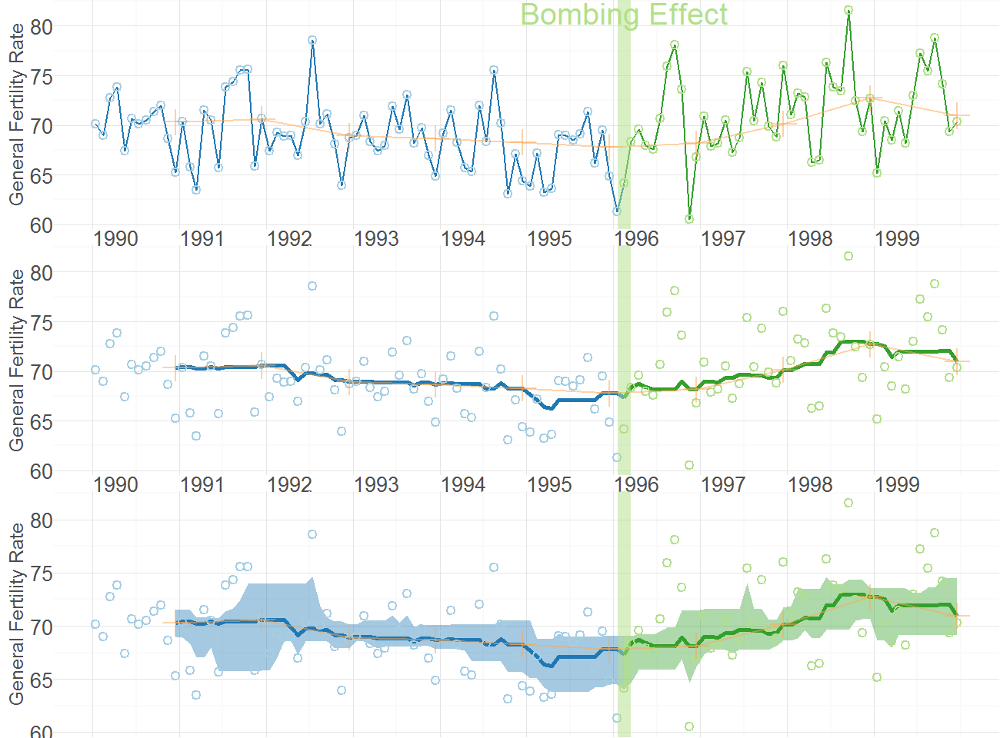
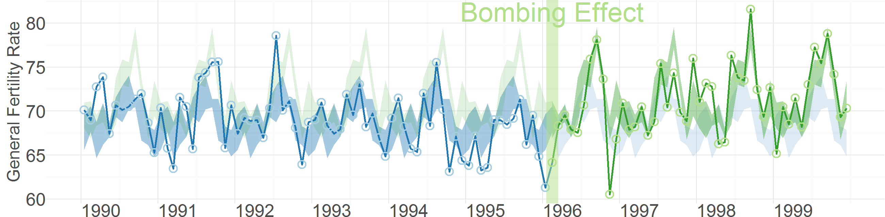
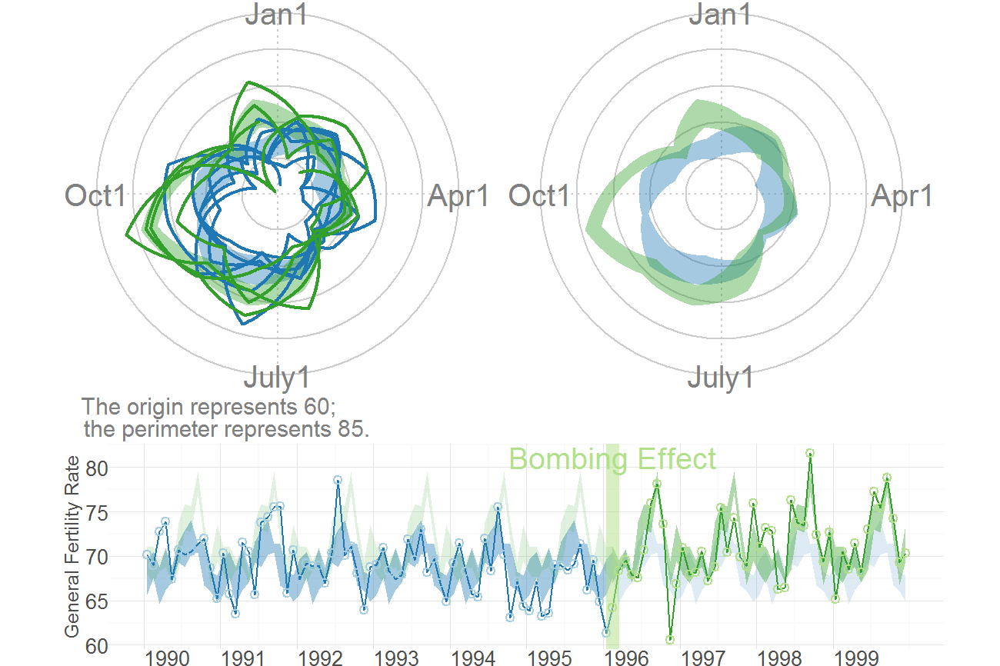

<!--
%\VignetteEngine{knitr::knitr}
%\VignetteIndexEntry{Assesing OKC Fertility with Intercensal Estimates}
-->

# Assesing OKC Fertility with Intercensal Estimates
The MBR manuscript demonstrates WATS plots with data prepared for Rodgers, J. L., St. John, C. A. & Coleman R.  (2005).  Did Fertility Go Up after the Oklahoma City Bombing?  An Analysis of Births in Metropolitan Counties in Oklahoma, 1990-1999.  *Demography, 42*, 675-692.


```r
changeMonth <- base::as.Date("1996-02-15") #as.Date("1995-04-19") + lubridate::weeks(39) = "1996-01-17"

vpLayout <- function(x, y) { grid::viewport(layout.pos.row=x, layout.pos.col=y) }

fullSpread <- function( scores) { 
  return( base::range(scores) ) #A new function isn't necessary.  It's defined in order to be consistent.
}
hSpread <- function( scores) { 
  return( stats::quantile(x=scores, probs=c(.25, .75)) ) 
}
seSpread <- function( scores) { 
  return( base::mean(scores) + base::c(-1, 1) * stats::sd(scores) / base::sqrt(base::length(scores)) ) 
}
bootSpread <- function( scores, conf=.66 ) {
  plugin <- function( d, i ) { base::mean(d[i]) }

  dist <- boot::boot(data=scores, plugin, R=99) #999 for the publication
  ci <- boot::boot.ci(dist, type = c("bca"), conf=conf)
  return( ci$bca[4:5] ) #The fourth & fifth elements correspond to the lower & upper bound.
}

darkTheme <- ggplot2::theme(
  axis.title          = ggplot2::element_text(color="gray30", size=9),
  axis.text.x         = ggplot2::element_text(color="gray30", hjust=0),
  axis.text.y         = ggplot2::element_text(color="gray30"),
  axis.ticks.length   = grid::unit(0, "cm"),
  axis.ticks.margin   = grid::unit(.00001, "cm"),
#   panel.grid.minor.y  = element_line(color="gray95", size=.1),
#   panel.grid.major    = element_line(color="gray90", size=.1),
  panel.margin        = grid::unit(c(0, 0, 0, 0), "cm"),
  plot.margin         = grid::unit(c(0, 0, 0, 0), "cm")
)
lightTheme <- darkTheme + ggplot2::theme(
  axis.title          = ggplot2::element_text(color="gray80", size=9),
  axis.text.x         = ggplot2::element_text(color="gray80", hjust=0),
  axis.text.y         = ggplot2::element_text(color="gray80"),
  panel.grid.minor.y  = ggplot2::element_line(color="gray99", size=.1),
  panel.grid.major    = ggplot2::element_line(color="gray95", size=.1)
)
dateSequence <- base::seq.Date(from=base::as.Date("1990-01-01"), to=base::as.Date("1999-01-01"), by="years")
xScale       <- ggplot2::scale_x_date(breaks=dateSequence, labels=scales::date_format("%Y"))
xScaleBlank  <- ggplot2::scale_x_date(breaks=dateSequence, labels=NULL) #This keeps things proportional down the three frames.
```


## Section 1: Cartesian Rolling plot


```r
dsLinear <- utils::read.csv("./Datasets/CountyMonthBirthRate2014Version.csv", stringsAsFactors=FALSE)
dsLinear <- dsLinear[dsLinear$CountyName=="oklahoma", ] 
dsLinear$Date <- as.Date(dsLinear$Date)

# Uncomment this line to use the version built into the package.  By default, it uses the
# CSV to promote reproducible research, since the CSV format is more open and accessible to more software.
# dsLinear <- CountyMonthBirthRate2014Version[CountyMonthBirthRate2014Version$CountyName=="oklahoma", ] 

dsLinear <- AugmentYearDataWithMonthResolution(dsLinear=dsLinear, dateName="Date")

portfolioCartesian <- AnnotateData(dsLinear, dvName="BirthRate", centerFunction=median, spreadFunction=hSpread)

topPanel <- CartesianRolling(
  dsLinear = portfolioCartesian$dsLinear, 
  xName = "Date", 
  yName = "BirthRate", 
  stageIDName = "StageID", 
  changePoints = changeMonth, 
  yTitle = "General Fertility Rate",
  changePointLabels = "Bombing Effect", 
  drawRollingBand = FALSE, 
  drawRollingLine = FALSE
)

middlePanel <- CartesianRolling(
  dsLinear = portfolioCartesian$dsLinear, 
  xName = "Date", 
  yName = "BirthRate", 
  stageIDName = "StageID", 
  changePoints = changeMonth, 
  yTitle = "General Fertility Rate",
  changePointLabels = "", 
  drawRollingBand = FALSE, 
  drawJaggedLine = FALSE
)

bottomPanel <- CartesianRolling(
  dsLinear = portfolioCartesian$dsLinear, 
  xName = "Date", 
  yName = "BirthRate", 
  stageIDName = "StageID", 
  changePoints = changeMonth, 
  yTitle = "General Fertility Rate", 
  changePointLabels = "", 
  drawJaggedLine = FALSE
)

topPanel <- topPanel + xScale + darkTheme
middlePanel <- middlePanel + xScale + darkTheme
bottomPanel <- bottomPanel + xScaleBlank + darkTheme

grid.newpage()
pushViewport(viewport(layout=grid.layout(3,1)))
print(topPanel, vp=vpLayout(1, 1))
print(middlePanel, vp=vpLayout(2, 1))
```

```
Warning: Removed 11 rows containing missing values (geom_path).
```

```r
print(bottomPanel, vp=vpLayout(3, 1))
```

```
Warning: Removed 11 rows containing missing values (geom_path).
```

```r
popViewport()
```




## Section 2: Carteisan Periodic 
Carteisan plot of the GFR time series data in Oklahoma County, with H-spread Bands superimposed.


```r
cartesianPeriodic <- CartesianPeriodic(
  portfolioCartesian$dsLinear, 
  portfolioCartesian$dsPeriodic, 
  xName = "Date", 
  yName = "BirthRate",
  stageIDName = "StageID", 
  changePoints = changeMonth, 
  changePointLabels = "Bombing Effect",
  yTitle = "General Fertility Rate",
  drawPeriodicBand = TRUE #The only difference from the simple linear graph above
)
cartesianPeriodic <- cartesianPeriodic + xScale + darkTheme 
print(cartesianPeriodic)
```




## Section 3: Polar Periodic
Wrap Around Time Series (WATS Plot) of the Oklahoma City GFR data, 1990-1999


```r
portfolioPolar <- PolarizeCartesian(
  dsLinear = portfolioCartesian$dsLinear, 
  dsStageCycle = portfolioCartesian$dsStageCycle, 
  yName = "BirthRate", 
  stageIDName = "StageID", 
  plottedPointCountPerCycle = 7200
)

grid.newpage()
pushViewport(viewport(
  layout=grid.layout(
    nrow = 2, ncol = 2, respect = TRUE, 
    widths = unit(c(1,1), c("null", "null")), 
    heights = unit(c(1,.5), c("null", "null"))
  ), 
  gp = gpar(cex=1, fill=NA)
))

## Create top left panel
pushViewport(viewport(layout.pos.col=1, layout.pos.row=1))
topLeftPanel <- PolarPeriodic(  
  dsLinear = portfolioPolar$dsObservedPolar, 
  dsStageCyclePolar = portfolioPolar$dsStageCyclePolar, 
  yName = "Radius", 
  stageIDName = "StageID", #graphCeiling=7, 
  cardinalLabels = c("Jan1", "Apr1", "July1", "Oct1")
)
upViewport()

## Create top right panel
pushViewport(viewport(layout.pos.col=2, layout.pos.row=1))
topRighttPanel <- PolarPeriodic(
  dsLinear = portfolioPolar$dsObservedPolar, 
  dsStageCyclePolar = portfolioPolar$dsStageCyclePolar, 
  yName = "Radius", 
  stageIDName = "StageID", #graphCeiling=7, 
  drawObservedLine = FALSE,
  cardinalLabels = c("Jan1", "Apr1", "July1", "Oct1"), 
  originLabel = NULL
)
upViewport()

## Create bottom panel
pushViewport(viewport(layout.pos.col=1:2, layout.pos.row=2, gp=gpar(cex=1)))
print(cartesianPeriodic, vp=vpLayout(x=1:2, y=2)) #Print across both columns of the bottom row.
upViewport()
```




## Section 4: Confirmatory Analysis of Interrupted Time Series
This figure compares Oklahoma County against the (other) largest urban counties.

```r
dsLinearAll <- AugmentYearDataWithMonthResolution(dsLinear=CountyMonthBirthRate2005Version, dateName="Date")

tsData <- stats::ts(
  data = dsLinear$BirthRate, 
  start = as.integer(dsLinear[1, c("Year", "Month")]), 
  end = as.integer(dsLinear[nrow(dsLinear), c("Year", "Month")]),
  frequency = 12
)
```


## Session Info
For the sake of documentation and reproducibility, the current vignette was build on a system using the following software.


```
Report created by Will at 12/25/2013 11:14:13 PM, Central Standard Time
```

```
R version 3.0.2 Patched (2013-12-17 r64473)
Platform: x86_64-w64-mingw32/x64 (64-bit)

locale:
[1] LC_COLLATE=English_United States.1252  LC_CTYPE=English_United States.1252    LC_MONETARY=English_United States.1252
[4] LC_NUMERIC=C                           LC_TIME=English_United States.1252    

attached base packages:
[1] grid      stats     graphics  grDevices utils     datasets  methods   base     

other attached packages:
[1] Wats_0.2-3      boot_1.3-9      ggplot2_0.9.3.1 scales_0.2.3    plyr_1.8        knitr_1.5      

loaded via a namespace (and not attached):
 [1] colorspace_1.2-4   dichromat_2.0-0    digest_0.6.4       evaluate_0.5.1     formatR_0.10       gtable_0.1.2      
 [7] labeling_0.2       lattice_0.20-24    lubridate_1.3.2    MASS_7.3-29        memoise_0.1        munsell_0.4.2     
[13] proto_0.3-10       RColorBrewer_1.0-5 reshape2_1.2.2     stringr_0.6.2      testit_0.3         tools_3.0.2       
[19] zoo_1.7-10        
```

