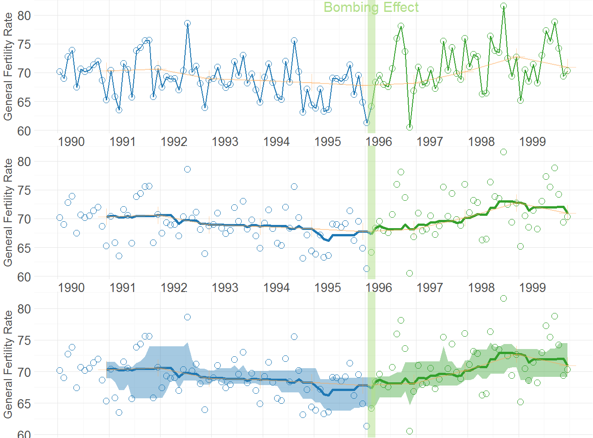
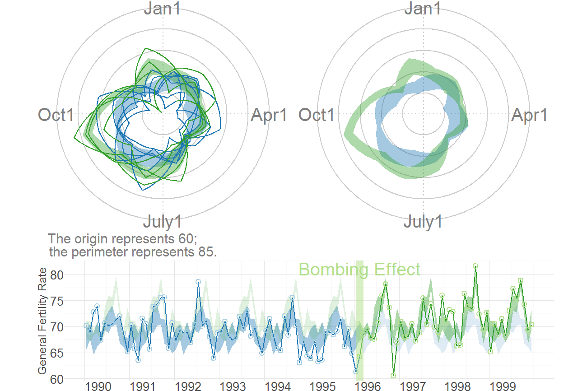
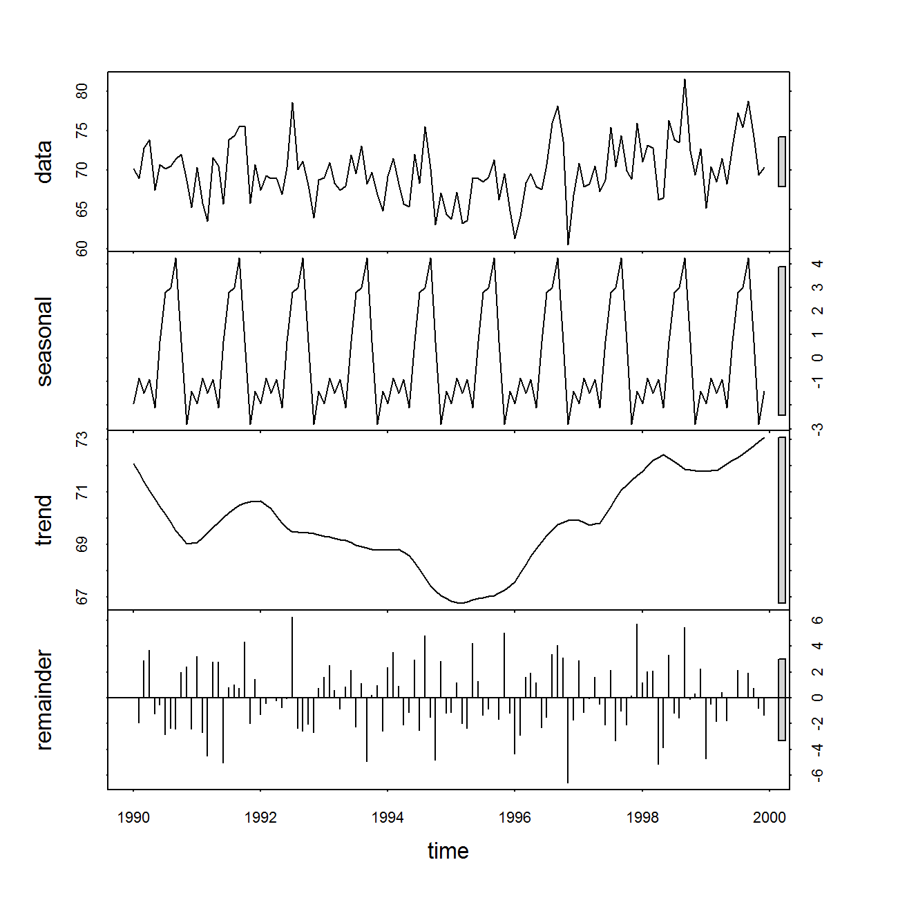

<!--
%\VignetteEngine{knitr::knitr}
%\VignetteIndexEntry{Assesing OKC Fertility with Intercensal Estimates}
-->
<!-- rmarkdown v1 -->

# Assesing OKC Fertility with Intercensal Estimates
The MBR manuscript demonstrates WATS plots with data prepared for Rodgers, St. John, & Coleman (2005).  In that paper and the MBR manuscript, the denominator of the GFR (General Fertility Rate) is the initial 1990 county population of females ages 15-44.  

This vignette uses slightly different Census estimates.  The intercensal population estimates (for females ages 15-44) are used for Jan 1990, Jan 1991, Jan 1992, ..., Jan 2000.  Linear interpolation is then used to complete the remaining 11 months of each year.  These monthly estimates become the denominator of each county's monthly GFR.


```r
changeMonth <- base::as.Date("1996-02-15") #as.Date("1995-04-19") + lubridate::weeks(39) = "1996-01-17"

vpLayout <- function(x, y) { grid::viewport(layout.pos.row=x, layout.pos.col=y) }

fullSpread <- function( scores ) { 
  return( base::range(scores) ) #A new function isn't necessary.  It's defined in order to be consistent.
}
hSpread <- function( scores ) { 
  return( stats::quantile(x=scores, probs=c(.25, .75)) ) 
}
seSpread <- function( scores ) { 
  return( base::mean(scores) + base::c(-1, 1) * stats::sd(scores) / base::sqrt(base::sum(!base::is.na(scores))) ) 
}
bootSpread <- function( scores, conf=.68 ) {
  plugin <- function( d, i ) { base::mean(d[i]) }

  distribution <- boot::boot(data=scores, plugin, R=99) #999 for the publication
  ci <- boot::boot.ci(distribution, type = c("bca"), conf=conf)
  return( ci$bca[4:5] ) #The fourth & fifth elements correspond to the lower & upper bound.
}

darkTheme <- ggplot2::theme(
  axis.title          = ggplot2::element_text(color="gray30", size=9),
  axis.text.x         = ggplot2::element_text(color="gray30", hjust=0),
  axis.text.y         = ggplot2::element_text(color="gray30"),
  axis.ticks.length   = grid::unit(0, "cm"),
  axis.ticks.margin   = grid::unit(.00001, "cm"),
#   panel.grid.minor.y  = element_line(color="gray95", size=.1),
#   panel.grid.major    = element_line(color="gray90", size=.1),
  panel.margin        = grid::unit(c(0, 0, 0, 0), "cm"),
  plot.margin         = grid::unit(c(0, 0, 0, 0), "cm")
)
lightTheme <- darkTheme + ggplot2::theme(
  axis.title          = ggplot2::element_text(color="gray80", size=9),
  axis.text.x         = ggplot2::element_text(color="gray80", hjust=0),
  axis.text.y         = ggplot2::element_text(color="gray80"),
  panel.grid.minor.y  = ggplot2::element_line(color="gray99", size=.1),
  panel.grid.major    = ggplot2::element_line(color="gray95", size=.1)
)
dateSequence <- base::seq.Date(from=base::as.Date("1990-01-01"), to=base::as.Date("1999-01-01"), by="years")
xScale       <- ggplot2::scale_x_date(breaks=dateSequence, labels=scales::date_format("%Y"))
xScaleBlank  <- ggplot2::scale_x_date(breaks=dateSequence, labels=NULL) #This keeps things proportional down the three frames.
```

## Section 1: Cartesian Rolling Plot
This section corresponds to the MBR manuscript, but with the modified dataset.

Smoothed monthly  birth rates (General Fertility Rates;  GFR's) for Oklahoma County, 1990-1999, plotted in a linear plot.  The top plot shows the connected raw data with a February smoother; the middle plot shows smoothing with a 12-month moving average, blue/green line, superimposed on a February smoother, red tan line); the bottom plot shows the smoothers and confidence bands, which are H-spreads (ie, the distance between the .25 and .75 quantiles) defined using the distribution of GFR's for the given month and 11 previous months.


```r
# dsLinear <- utils::read.csv("./Datasets/CountyMonthBirthRate2014Version.csv", stringsAsFactors=FALSE)
# dsLinear$Date <- base::as.Date(dsLinear$Date)
# dsLinear <- dsLinear[dsLinear$CountyName=="oklahoma", ] 

# Uncomment this line to use the version built into the package.  By default, it uses the
# CSV to promote reproducible research, since the CSV format is more open and accessible to more software.
dsLinearAll <- CountyMonthBirthRate2014Version
dsLinear <- dsLinearAll[dsLinearAll$CountyName=="oklahoma", ] 

dsLinear <- Wats::AugmentYearDataWithMonthResolution(dsLinear=dsLinear, dateName="Date")

portfolioCartesian <- Wats::AnnotateData(dsLinear, dvName="BirthRate", centerFunction=stats::median, spreadFunction=hSpread)

topPanel <- Wats::CartesianRolling(
  dsLinear = portfolioCartesian$dsLinear, 
  xName = "Date", 
  yName = "BirthRate", 
  stageIDName = "StageID", 
  changePoints = changeMonth, 
  yTitle = "General Fertility Rate",
  changePointLabels = "Bombing Effect", 
  drawRollingBand = FALSE, 
  drawRollingLine = FALSE
)

middlePanel <- CartesianRolling(
  dsLinear = portfolioCartesian$dsLinear, 
  xName = "Date", 
  yName = "BirthRate", 
  stageIDName = "StageID", 
  changePoints = changeMonth, 
  yTitle = "General Fertility Rate",
  changePointLabels = "", 
  drawRollingBand = FALSE, 
  drawJaggedLine = FALSE
)

bottomPanel <- Wats::CartesianRolling(
  dsLinear = portfolioCartesian$dsLinear, 
  xName = "Date", 
  yName = "BirthRate", 
  stageIDName = "StageID", 
  changePoints = changeMonth, 
  yTitle = "General Fertility Rate", 
  changePointLabels = "", 
  drawJaggedLine = FALSE
)

topPanel <- topPanel + xScale + darkTheme
middlePanel <- middlePanel + xScale + darkTheme
bottomPanel <- bottomPanel + xScaleBlank + darkTheme

grid::grid.newpage()
grid::pushViewport(grid::viewport(layout=grid::grid.layout(3,1)))
print(topPanel, vp=vpLayout(1, 1))
print(middlePanel, vp=vpLayout(2, 1))
```

```
Warning in loop_apply(n, do.ply): Removed 11 rows containing missing values (geom_path).
```

```r
print(bottomPanel, vp=vpLayout(3, 1))
```

```
Warning in loop_apply(n, do.ply): Removed 11 rows containing missing values (geom_path).
```

```r
grid::popViewport()
```



## Section 2: Carteisan Periodic 
This section corresponds to the MBR manuscript, but with the modified dataset.

Carteisan plot of the GFR time series data in Oklahoma County, with H-spread Bands superimposed.


```r
cartesianPeriodic <- Wats::CartesianPeriodic(
  portfolioCartesian$dsLinear, 
  portfolioCartesian$dsPeriodic, 
  xName = "Date", 
  yName = "BirthRate",
  stageIDName = "StageID", 
  changePoints = changeMonth, 
  changePointLabels = "Bombing Effect",
  yTitle = "General Fertility Rate",
  drawPeriodicBand = TRUE #The only difference from the simple linear graph above
)
cartesianPeriodic <- cartesianPeriodic + xScale + darkTheme 
print(cartesianPeriodic)
```


## Section 3: Polar Periodic
This section corresponds to the MBR manuscript, but with the modified dataset.

Wrap Around Time Series (WATS Plot) of the Oklahoma City GFR data, 1990-1999


```r
portfolioPolar <- Wats::PolarizeCartesian(
  dsLinear = portfolioCartesian$dsLinear, 
  dsStageCycle = portfolioCartesian$dsStageCycle, 
  yName = "BirthRate", 
  stageIDName = "StageID", 
  plottedPointCountPerCycle = 7200
)

grid::grid.newpage()
grid::pushViewport(grid::viewport(
  layout=grid::grid.layout(
    nrow = 2, ncol = 2, respect = TRUE, 
    widths = grid::unit(c(1,1), c("null", "null")), 
    heights = grid::unit(c(1,.5), c("null", "null"))
  ), 
  gp = grid::gpar(cex=1, fill=NA)
))

## Create top left panel
grid::pushViewport(grid::viewport(layout.pos.col=1, layout.pos.row=1))
topLeftPanel <- Wats::PolarPeriodic(  
  dsLinear = portfolioPolar$dsObservedPolar, 
  dsStageCyclePolar = portfolioPolar$dsStageCyclePolar, 
  yName = "Radius", 
  stageIDName = "StageID",
  cardinalLabels = c("Jan1", "Apr1", "July1", "Oct1")
)
grid::upViewport()

## Create top right panel
grid::pushViewport(grid::viewport(layout.pos.col=2, layout.pos.row=1))
topRighttPanel <- Wats::PolarPeriodic(
  dsLinear = portfolioPolar$dsObservedPolar, 
  dsStageCyclePolar = portfolioPolar$dsStageCyclePolar, 
  yName = "Radius", 
  stageIDName = "StageID",
  drawObservedLine = FALSE,
  cardinalLabels = c("Jan1", "Apr1", "July1", "Oct1"), 
  originLabel = NULL
)
grid::upViewport()

## Create bottom panel
grid::pushViewport(grid::viewport(layout.pos.col=1:2, layout.pos.row=2, gp=grid::gpar(cex=1)))
print(cartesianPeriodic, vp=vpLayout(x=1:2, y=2)) #Print across both columns of the bottom row.
upViewport()
```



## Section 4: Confirmatory Analysis of Interrupted Time Series
The remaining two sections depart from the MBR manuscript analyses.  Its goal is to determine if the significant findings of Rodgers, St. John, & Coleman still appear with the modified Census estimates.  As shown below, the the post-bombing fertility is still significantly higher than the pre-bombing fertility.

This section uses an approach advocated by McLeod, Yu, & Mahdi (2011), which is consistent other articles, including Rodgers et al. (2005).  There are two trends that are de-seasonalized.  The first is the 'classic' approach which uses the observed trend line (see [`decompose()` on CRAN](http://stat.ethz.ch/R-manual/R-devel/library/stats/html/decompose.html)).  The second is a smoothed version, where a loess is passed through the observed data; this smoothed line is then de-seasonalized (see [`stl()` on CRAN](stat.ethz.ch/R-manual/R-devel/library/stats/html/stl.html)).  Both approaches lead to comparable conclusions.  The post-bombing fertility is significantly higher  than the pre-bombing fertility (ie, the `step` coefficient is significantly more positive).


```r
dsLinear <- Wats::AugmentYearDataWithMonthResolution(dsLinear=dsLinear, dateName="Date")

tsData <- stats::ts(
  data = dsLinear$BirthRate, 
  start = as.integer(dsLinear[1, c("Year", "Month")]), 
  end = as.integer(dsLinear[nrow(dsLinear), c("Year", "Month")]),
  frequency = 12L
)

#Create unsmoothed and smoothed version
seasonalClassic <- stats::decompose(tsData)
plot(seasonalClassic)
```


```r
#Watch out, the 2nd & 3rd columns have swapped positions, compared to `decompose()`
seasonalLoess <- stats::stl(x = tsData, s.window = "periodic") 
plot(seasonalLoess)
```



```r
# Seasonality is accounted for without a smoother
lag1 <- 1L #Significant for many different values of lag, including 1
y <- seasonalClassic$trend[(lag1+1):length(seasonalClassic$trend)]
y1 <- seasonalClassic$trend[1:(length(seasonalClassic$trend)-lag1)]
# step <- c(rep(0L, times=sum(dsLinear$StageID==1L)-lag1), rep(1L, times=sum(dsLinear$StageID==2L)))
step <- dsLinear$StageID[(lag1+1):length(seasonalClassic$trend)] - 1L
dsClassic <- data.frame(y=y, y1=y1, step=step)
rm(lag1, y, y1, step)
fitClassic <-  glm(y ~ 1 + step + y1, data=dsClassic)
summary(fitClassic)
```

```

Call:
glm(formula = y ~ 1 + step + y1, data = dsClassic)

Deviance Residuals: 
     Min        1Q    Median        3Q       Max  
-0.52261  -0.14205  -0.00242   0.17035   0.56659  

Coefficients:
            Estimate Std. Error t value Pr(>|t|)    
(Intercept)  3.12546    1.27382   2.454 0.015805 *  
step         0.23557    0.05921   3.979 0.000128 ***
y1           0.95401    0.01850  51.578  < 2e-16 ***
---
Signif. codes:  0 '***' 0.001 '**' 0.01 '*' 0.05 '.' 0.1 ' ' 1

(Dispersion parameter for gaussian family taken to be 0.05895646)

    Null deviance: 264.4499  on 106  degrees of freedom
Residual deviance:   6.1315  on 104  degrees of freedom
  (12 observations deleted due to missingness)
AIC: 5.6977

Number of Fisher Scoring iterations: 2
```

```r
#Seasonality is accounted for after a loess is fit through it.
lag1 <- 1L #Significant for many different values of lag, including 1
trendLineLoess <- as.numeric(seasonalLoess$time.series[, 2])
y <- trendLineLoess[(lag1+1):length(trendLineLoess)]
y1 <- trendLineLoess[1:(length(trendLineLoess) - lag1)]
# step <- c(rep(0L, times=sum(dsLinear$StageID==1L)-lag1), rep(1L, times=sum(dsLinear$StageID==2L)))
step <- dsLinear$StageID[(lag1+1):length(trendLineLoess)] - 1L
dsLoess <- data.frame(y=y, y1=y1, step=step)
rm(lag1, y, y1, step)
fitLoess <-  glm(y ~ 1 + step + y1, data=dsLoess)
summary(fitLoess)
```

```

Call:
glm(formula = y ~ 1 + step + y1, data = dsLoess)

Deviance Residuals: 
     Min        1Q    Median        3Q       Max  
-0.29624  -0.11635   0.02857   0.08494   0.28554  

Coefficients:
            Estimate Std. Error t value Pr(>|t|)    
(Intercept) 2.646448   0.655697   4.036 9.78e-05 ***
step        0.253485   0.031899   7.946 1.38e-12 ***
y1          0.960768   0.009493 101.210  < 2e-16 ***
---
Signif. codes:  0 '***' 0.001 '**' 0.01 '*' 0.05 '.' 0.1 ' ' 1

(Dispersion parameter for gaussian family taken to be 0.01982663)

    Null deviance: 326.6507  on 118  degrees of freedom
Residual deviance:   2.2999  on 116  degrees of freedom
AIC: -123.9

Number of Fisher Scoring iterations: 2
```

## Section 5: Confirmatory Analysis of Interrupted Time Series with Bayes Factors
A similar set of Bayesian analyses support the claim that post-bombing fertility is higher.  The `BayesSingleSub` package by De Vries and Morey.  The third number in each row describes the test for a mean different.  The package also has tests that indicate the post-bombing slope may be more positive than the pre-bombing slope.  Significance is sugested with a Bayes Factors is less than one (and therefore its log is negative).


```r
# Seasonality is accounted for without a smoother
beforeClassic <- seasonalClassic$trend[dsLinear$StageID==1L]
afterClassic <- seasonalClassic$trend[dsLinear$StageID==2L]

#Set the number of MCMC iterations
mcmcRepCount <- 1000#000
#Determine if the intermediate progress should be displayed
showMcmcProgress <- FALSE

(gClassic <- BayesSingleSub::trendtest.Gibbs.AR(beforeClassic[!is.na(beforeClassic)], afterClassic[!is.na(afterClassic)], return.chains=F, iterations=mcmcRepCount, progress=showMcmcProgress))
```

```

 rho acceptance rate: 0.09109109 
```

```
 logbf.i+t logbf.trend  logbf.int
 -6.917674   -7.354658 -0.2071785
```

```r
(mcClassic <- BayesSingleSub::trendtest.MC.AR(beforeClassic[!is.na(beforeClassic)], afterClassic[!is.na(afterClassic)], iterations=mcmcRepCount, progress=showMcmcProgress))
```

```
 logbf.joint logbf.trend  logbf.int
   -1.178508    -27.5585 -0.5848155
```

```r
# summary(mcClassic)
# coda::gelman.diag(g$chains) #it needs multiple chains to asses.

#Seasonality is accounted for after a loess is fit through it.
beforeLoess <- seasonalLoess$time.series[dsLinear$StageID==1L, 2]
afterLoess <- seasonalLoess$time.series[dsLinear$StageID==2L, 2]
BayesSingleSub::trendtest.Gibbs.AR(beforeLoess, afterLoess, iterations=mcmcRepCount, progress=showMcmcProgress)
```

```

 rho acceptance rate: 0.04804805 
```

```
 logbf.i+t logbf.trend  logbf.int
 -25.88079   -24.32235 -0.8059051
```

```r
BayesSingleSub::trendtest.MC.AR(beforeLoess, afterLoess, iterations=mcmcRepCount, progress=showMcmcProgress)
```

```
 logbf.joint logbf.trend logbf.int
    7.492727   -69.77006 -6.652696
```

## Session Info
The current vignette was build on a system using the following software.


```
Report created by Will at Tue Apr 21 11:34:49 2015, -0500
```

```
R version 3.2.0 Patched (2015-04-19 r68206)
Platform: x86_64-w64-mingw32/x64 (64-bit)
Running under: Windows 8 x64 (build 9200)

locale:
[1] LC_COLLATE=English_United States.1252  LC_CTYPE=English_United States.1252    LC_MONETARY=English_United States.1252
[4] LC_NUMERIC=C                           LC_TIME=English_United States.1252    

attached base packages:
[1] grid      stats     graphics  grDevices utils     datasets  methods   base     

other attached packages:
[1] Wats_0.9-6    boot_1.3-16   ggplot2_1.0.1 scales_0.2.4  plyr_1.8.2    knitr_1.9    

loaded via a namespace (and not attached):
 [1] Rcpp_0.11.5          MASS_7.3-40          munsell_0.4.2        testit_0.4           colorspace_1.2-6    
 [6] lattice_0.20-31      stringr_0.6.2        MCMCpack_1.3-3       tools_3.2.0          gtable_0.1.2        
[11] coda_0.17-1          BayesSingleSub_0.6.2 digest_0.6.8         RColorBrewer_1.1-2   reshape2_1.4.1      
[16] formatR_1.2          memoise_0.2.1        evaluate_0.7         labeling_0.3         mvtnorm_1.0-2       
[21] lubridate_1.3.3      proto_0.3-10         zoo_1.7-12          
```

## References
* McLeod, A.I., Yu, H., & Mahdi, E. (2011). [Time series analysis with R](http://www.stats.uwo.ca/faculty/aim/tsar/tsar.pdf). *Handbook of Statistics*, Volume 30, Elsevier. 
* Rodgers, J. L., St. John, C. A. & Coleman R.  (2005).  [Did Fertility Go Up after the Oklahoma City Bombing?  An Analysis of Births in Metropolitan Counties in Oklahoma, 1990-1999](http://www.ncbi.nlm.nih.gov/pubmed/16463916).  *Demography, 42*, 675-692.
* De Vries, R. M. & Morey, R. D. (submitted). Bayesian hypothesis testing Single-Subject Data. *Psychological Methods*.
* [US Census Intercensal Estimates](http://www.census.gov/popest/data/intercensal/index.html) for [199x](http://www.census.gov/popest/data/counties/totals/1990s/CO-99-02.html) and [200x](http://www.census.gov/popest/data/intercensal/county/county2010.html).
