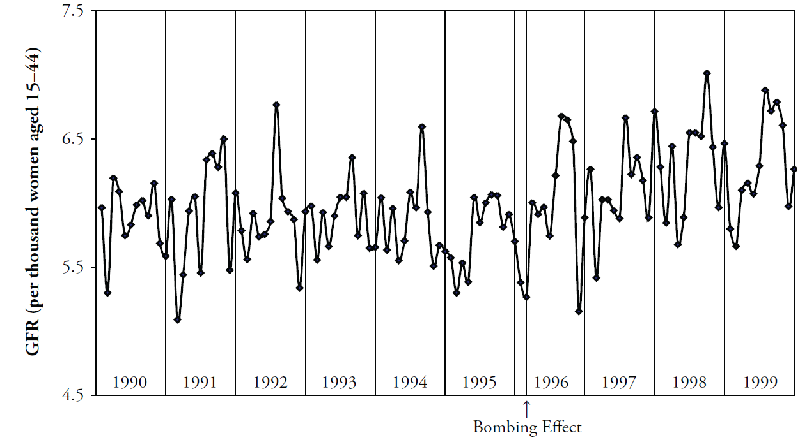

This vignette produces the graphs included in the initial MBR manuscript.

```{r set_root_directory, echo = FALSE, results='hide'}
#It works better if the root directory is set in its own chunk.
# library(knitr)
# knitr::opts_knit$set(root.dir = "../")
```

```{r}
#| set_options,
#| echo = FALSE,
#| results = 'hide',

library(Wats)
suppressPackageStartupMessages({
  requireNamespace("boot")
  requireNamespace("dplyr")
  requireNamespace("ggplot2")
  requireNamespace("grDevices")
  requireNamespace("grid")
  requireNamespace("scales")
})

knitr::opts_chunk$set(
  comment    = NA,
  tidy       = FALSE,
  fig.width  = 6.5,
  fig.height = 1.6,
  out.width  = "600px", # This affects only the markdown, not the underlying png file.  The height will be scaled appropriately.
  fig.path   = "figure-mbr-rmd/"
  # dev      = "pdf", # Uncomment to produce vector graphics for publication; however png (the default) works better within html (ie, the format of this vignette).
  # dpi      = 400
)

base::options(width = 120) # So the output is 50% wider than the default.
pdf.options(useDingbats = FALSE) # Otherwise, the circles don't get plotted correctly in some graphs
if ( base::Sys.info()["sysname"] == "Windows")
  grDevices::windows.options(antialias = "cleartype")
set.seed(444) # Avoid bootstrap from triggering diffs
```

## Figure 1: Cartesian Rolling - 2005 Version

Figure 1:  Raw monthly birth rates (General Fertility Rates;  GFR's) for Oklahoma County, 1990-1999, plotted in a linear plot;  the "bombing effect" is located ten months after the Oklahoma City bombing.



## Figure 2: Cartesian Rolling - 2014 Version

Smoothed monthly birth rates (General Fertility Rates; GFRs) for Oklahoma County, 1990-1999, plotted in a linear plot.  The top plot shows the connected raw data with a February smoother; the middle plot shows smoothing with a 12-month moving average, blue/green line, superimposed on a February smoother, red line); the bottom plot shows the smoothers and confidence bands, which are H-spreads defined using the distribution of GFR's for the given month and 11 previous months.

First, some R packages are loaded, and some variables and functions are defined.

```{r}
#| Definitions,
change_month <- base::as.Date("1996-02-15") #as.Date("1995-04-19") + lubridate::weeks(39) = "1996-01-17"
set.seed(444) # So bootstrap won't trigger a git diff

vp_layout <- function(x, y) {
  grid::viewport(layout.pos.row = x, layout.pos.col = y)
}
full_spread <- function(scores) {
  base::range(scores) # A new function isn't necessary.  It's defined in order to be consistent.
}
h_spread <- function(scores) {
  stats::quantile(x = scores, probs = c(.25, .75))
}
se_spread <- function(scores) {
  base::mean(scores) + base::c(-1, 1) * stats::sd(scores) / base::sqrt(base::sum(!base::is.na(scores)))
}
boot_spread <- function(scores, conf = .68) {
  plugin <- function( d, i ) {
    base::mean(d[i])
  }

  distribution <- boot::boot(data = scores, plugin, R = 99) # 999 for the publication
  ci <- boot::boot.ci(distribution, type = c("bca"), conf = conf)
  ci$bca[4:5] # The fourth & fifth elements correspond to the lower & upper bound.
}

dark_theme <- ggplot2::theme(
  axis.title          = ggplot2::element_text(color = "gray30", size = 9),
  axis.text.x         = ggplot2::element_text(color = "gray30", hjust = 0),
  axis.text.y         = ggplot2::element_text(color = "gray30"),
  axis.ticks          = ggplot2::element_blank(),
  # panel.grid.minor.y  = element_line(color = "gray95", linewidth = .1),
  # panel.grid.major    = element_line(color = "gray90", linewidth = .1),
  panel.spacing       = grid::unit(c(0, 0, 0, 0), "cm"),
  plot.margin         = grid::unit(c(0, 0, 0, 0), "cm")
)
# qplot(mtcars$hp) + dark_theme

light_theme <-
  dark_theme +
  ggplot2::theme(
    axis.title          = ggplot2::element_text(color = "gray80", size = 9),
    axis.text.x         = ggplot2::element_text(color = "gray80", hjust = 0),
    axis.text.y         = ggplot2::element_text(color = "gray80"),
    panel.grid.minor.y  = ggplot2::element_line(color = "gray99", linewidth = .1),
    panel.grid.major    = ggplot2::element_line(color = "gray95", linewidth = .1)
  )
date_sequence <-
  base::seq.Date(
    from = base::as.Date("1990-01-01"),
    to   = base::as.Date("1999-01-01"),
    by   = "years"
  )
x_scale <-
  ggplot2::scale_x_date(
    breaks = date_sequence,
    labels = scales::date_format("%Y")
  )
# This keeps things proportional down the three frames.
x_scale_blank <-
  ggplot2::scale_x_date(
    breaks = date_sequence,
    labels = NULL
  )
```

### Individual Components

Here is the basic linear rolling graph.  It doesn't require much specification, and will work with a wide range of appropriate datasets.  This first (unpublished) graph displays all components.

```{r}
#| fig-2-individual-basic

# Uncomment the next two lines to use the version built into the package.  By default, it uses the
# CSV to promote reproducible research, since the CSV format is more open and accessible to more software.

ds_linear_all <-
  county_month_birth_rate_2005_version |>
  tibble::as_tibble()

ds_linear_okc <-
  ds_linear_all |>
  dplyr::filter(county_name == "oklahoma") |>
  augment_year_data_with_month_resolution(date_name = "date")

portfolio_cartesian <-
  annotate_data(
    ds_linear_okc,
    dv_name         = "birth_rate",
    center_function = stats::median,
    spread_function = h_spread
  )

cartesian_rolling(
  ds_linear           = portfolio_cartesian$ds_linear,
  x_name              = "date",
  y_name              = "birth_rate",
  stage_id_name       = "stage_id",
  change_points       = change_month,
  change_point_labels = "Bombing Effect"
)
```

The version for the manuscript was tweaked to take advantage of certain features of the dataset.  This is what it looks like when all three stylized panels are combined.

```{r}
#| fig-2-stylized,
#| fig.height = 4.8,
top_panel <-
  Wats::cartesian_rolling(
    ds_linear             = portfolio_cartesian$ds_linear,
    x_name                = "date",
    y_name                = "birth_rate",
    stage_id_name         = "stage_id",
    change_points         = change_month,
    y_title               = "General Fertility Rate",
    change_point_labels   = "Bombing Effect",
    draw_rolling_band     = FALSE,
    draw_rolling_line     = FALSE
  )

middle_panel <-
  Wats::cartesian_rolling(
    ds_linear             = portfolio_cartesian$ds_linear,
    x_name                = "date",
    y_name                = "birth_rate",
    stage_id_name         = "stage_id",
    change_points         = change_month,
    y_title               = "General Fertility Rate",
    change_point_labels   = "",
    draw_rolling_band     = FALSE,
    draw_jagged_line      = FALSE
  )

bottom_panel <-
  Wats::cartesian_rolling(
    ds_linear             = portfolio_cartesian$ds_linear,
    x_name                = "date",
    y_name                = "birth_rate",
    stage_id_name         = "stage_id",
    change_points         = change_month,
    y_title               = "General Fertility Rate",
    change_point_labels   = "",
    # draw_rolling_band   = FALSE,
    draw_jagged_line      = FALSE
  )

top_panel    <- top_panel    + x_scale       + dark_theme
middle_panel <- middle_panel + x_scale       + dark_theme
bottom_panel <- bottom_panel + x_scale_blank + dark_theme

grid::grid.newpage()
grid::pushViewport(grid::viewport(layout = grid::grid.layout(3,1)))
print(top_panel   , vp = vp_layout(1, 1))
print(middle_panel, vp = vp_layout(2, 1))
print(bottom_panel, vp = vp_layout(3, 1))
grid::popViewport()
```

## Figure 4: Cartesian Periodic

Cartesian plot of the GFR time series data in Oklahoma County, with H-spread Bands superimposed.

```{r}
#| fig-4-basic
cartesian_periodic <-
  Wats::cartesian_periodic(
    portfolio_cartesian$ds_linear,
    portfolio_cartesian$ds_periodic,
    x_name                  = "date",
    y_name                  = "birth_rate",
    stage_id_name           = "stage_id",
    change_points           = change_month,
    change_point_labels     = "Bombing Effect",
    y_title                 = "General Fertility Rate",
    draw_periodic_band      = TRUE #The only difference from the simple linear graph above
  )
print(cartesian_periodic)
```

```{r}
#| fig-4-stylized
cartesian_periodic <- cartesian_periodic + x_scale + dark_theme
print(cartesian_periodic)
```

## Figure 5: Polar Periodic

Wrap Around Time Series (WATS Plot) of the Oklahoma City GFR data, 1990-1999.

```{r}
#| fig-5,
#| fig.height = 3,
#| fig.width = 3,
#| out.width = "300px",
portfolio_polar <-
  polarize_cartesian(
    ds_linear                       = portfolio_cartesian$ds_linear,
    ds_stage_cycle                  = portfolio_cartesian$ds_stage_cycle,
    y_name                          = "birth_rate",
    stage_id_name                   = "stage_id",
    plotted_point_count_per_cycle   = 7200
  )

grid::grid.newpage()
polar_periodic(
  ds_linear             = portfolio_polar$ds_observed_polar,
  ds_stage_cycle        = portfolio_polar$ds_stage_cycle_polar,
  y_name                = "radius",
  stage_id_name         = "stage_id",
  draw_periodic_band    = FALSE,
  draw_stage_labels     = TRUE,
  draw_radius_labels    = TRUE,
  cardinal_labels       = c("Jan1", "Apr1", "July1", "Oct1")
)
```

## Figure 6: WATS and Cartesian

Wrap Around Time Series (WATS Plot) of the Oklahoma City GFR data, 1990-1999.

```{r}
#| fig-6,
#| fig.height = 6.5 * 2/3
portfolio_polar <-
  Wats::polarize_cartesian(
    ds_linear                     = portfolio_cartesian$ds_linear,
    ds_stage_cycle                = portfolio_cartesian$ds_stage_cycle,
    y_name                        = "birth_rate",
    stage_id_name                 = "stage_id",
    plotted_point_count_per_cycle = 7200
  )

grid::grid.newpage()
grid::pushViewport(grid::viewport(
  layout = grid::grid.layout(
    nrow    = 2,
    ncol    = 2,
    respect = TRUE,
    widths  = grid::unit(c(1,  1), c("null", "null")),
    heights = grid::unit(c(1, .5), c("null", "null"))
  ),
  gp = grid::gpar(cex = 1, fill = NA)
))

## Create top left panel
grid::pushViewport(grid::viewport(layout.pos.col = 1, layout.pos.row = 1))
top_left_panel <-
  Wats::polar_periodic(
    ds_linear             = portfolio_polar$ds_observed_polar,
    ds_stage_cycle_polar  = portfolio_polar$ds_stage_cycle_polar,
    y_name                = "radius",
    stage_id_name         = "stage_id", #graph_ceiling = 7,
    cardinal_labels       = c("Jan1", "Apr1", "July1", "Oct1")
  )
grid::upViewport()

## Create top right panel
grid::pushViewport(grid::viewport(layout.pos.col = 2, layout.pos.row = 1))
top_right_panel <-
  Wats::polar_periodic(
  ds_linear             = portfolio_polar$ds_observed_polar,
  ds_stage_cycle_polar  = portfolio_polar$ds_stage_cycle_polar,
  y_name                = "radius",
  stage_id_name         = "stage_id", #graph_ceiling = 7,
  draw_observed_line    = FALSE,
  cardinal_labels       = c("Jan1", "Apr1", "July1", "Oct1"),
  origin_label          = NULL
)
grid::upViewport()

## Create bottom panel
grid::pushViewport(grid::viewport(layout.pos.col = 1:2, layout.pos.row = 2, gp = grid::gpar(cex = 1)))
print(cartesian_periodic, vp = vp_layout(x = 1:2, y = 2)) # Print across both columns of the bottom row.
grid::upViewport()
```

## Figure 7: County Comparison

This figure compares Oklahoma County against the (other) largest urban counties.

```{r}
#| fig-7,
#| fig.height = 6.5,
# ds_linear_all <- Wats::augment_year_data_with_month_resolution(ds_linear = county_month_birth_rate_2005_version, date_name="date")

# Identify the average size of the fecund population
ds_linear_all |>
  dplyr::group_by(county_name) |>
  dplyr::summarize(
    Mean = base::mean(fecund_population)
  ) |>
  dplyr::ungroup()

graph_row_comparison <- function(
    row_label       = "",
    .county_name    = "oklahoma",
    spread_function = h_spread,
    change_month    = as.Date("1996-02-15")
) {
  ds_linear <-
    ds_linear_all |>
    dplyr::filter(county_name == .county_name) |>
    Wats::augment_year_data_with_month_resolution(date_name = "date")

  portfolio_cartesian <-
    ds_linear |>
    Wats::annotate_data(
      dv_name         = "birth_rate",
      center_function = stats::median,
      spread_function = spread_function
    )

  portfolio_polar <-
    portfolio_cartesian$ds_linear |>
    Wats::polarize_cartesian(
      ds_stage_cycle                = portfolio_cartesian$ds_stage_cycle,
      y_name                        = "birth_rate",
      stage_id_name                 = "stage_id",
      plotted_point_count_per_cycle = 7200
    )

  cartesian_periodic <-
    portfolio_cartesian$ds_linear |>
    Wats::cartesian_periodic(
      portfolio_cartesian$ds_periodic,
      x_name                            = "date",
      y_name                            = "birth_rate",
      stage_id_name                     = "stage_id",
      change_points                     = change_month,
      change_point_labels               = ""
  )

  grid::pushViewport(grid::viewport(
    layout =
      grid::grid.layout(
        nrow    = 1,
        ncol    = 3,
        respect = FALSE,
        widths  = grid::unit(c(1.5, 1, 3), c("line", "null", "null"))
      ),
    gp = grid::gpar(cex = 1, fill = NA)
  ))

  grid::pushViewport(grid::viewport(layout.pos.col = 1))
  grid::grid.rect(gp = grid::gpar(fill = "gray90", col = NA))
  grid::grid.text(row_label, rot = 90)
  grid::popViewport()

  grid::pushViewport(grid::viewport(layout.pos.col = 2))
  Wats::polar_periodic(
    ds_linear               = portfolio_polar$ds_observed_polar,
    ds_stage_cycle_polar    = portfolio_polar$ds_stage_cycle_polar,
    draw_observed_line      = FALSE,
    y_name                  = "radius",
    stage_id_name           = "stage_id",
    origin_label            = NULL,
    plot_margins            = c(0, 0, 0, 0)
  )
  grid::popViewport()

  grid::pushViewport(grid::viewport(layout.pos.col = 3))
  print(cartesian_periodic + x_scale + light_theme, vp = vp_layout(x = 1, y = 1))
  grid::popViewport()
  grid::popViewport() #Finish the row
}

county_names  <- c("Comanche", "Cleveland", "Oklahoma", "Tulsa", "Rogers")
counties      <- tolower(county_names)

grid::grid.newpage()
grid::pushViewport(grid::viewport(
  layout  = grid::grid.layout(nrow = length(counties), ncol = 1),
  gp      = grid::gpar(cex = 1, fill = NA)
))

for (i in base::seq_along(counties)) {
  grid::pushViewport(grid::viewport(layout.pos.row = i))
  graph_row_comparison(.county_name = counties[i], row_label = county_names[i])
  grid::popViewport()
}
grid::popViewport()
```

Here are all 12 counties that Ronnie collected birth records for.  This extended graph is not in the manuscript.

```{r}
#| fig-7-all-counties,
#| fig.height = 6.5 * 12/5
counties <- base::sort(base::unique(ds_linear_all$county_name))
county_names <- c("Canadian", "Cleveland", "Comanche", "Creek", "Logan", "McClain", "Oklahoma", "Osage", "Pottawatomie", "Rogers", "Tulsa", "Wagoner")

grid::grid.newpage()
grid::pushViewport(grid::viewport(
  layout  = grid::grid.layout(nrow = base::length(counties), ncol = 1),
  gp      = grid::gpar(cex = 1, fill = NA)
))

for (i in base::seq_along(counties)) {
  grid::pushViewport(grid::viewport(layout.pos.row = i))
  graph_row_comparison(.county_name = counties[i], row_label = county_names[i])
  grid::popViewport()
}
grid::popViewport()
```

## Figure 8: Error Band Comparison

This figure demonstrates that WATS accommodates many types of error bands.

```{r}
#| fig-8,
#| fig.height = 6.5 * 4/5,
spreads <- c("h_spread", "full_spread", "se_spread", "boot_spread")
spread_names <- c("H-Spread", "Range", "+/-1 SE", "Bootstrap")
grid::grid.newpage()
grid::pushViewport(grid::viewport(
  layout  = grid::grid.layout(nrow = base::length(spreads), ncol = 1),
  gp      = grid::gpar(cex = 1, fill = NA)
))
for (i in base::seq_along(spreads)) {
  grid::pushViewport(grid::viewport(layout.pos.row = i))
  graph_row_comparison(spread_function = base::get(spreads[i]), row_label = spread_names[i])
  grid::upViewport()
}
grid::upViewport()
```

## Session Info

The current vignette was build on a system using the following software.

```{r session_info, echo = FALSE}
base::cat("Report created by", base::Sys.info()["user"], "at", base::strftime(base::Sys.time(), "%c, %z"))
utils::sessionInfo()
```
