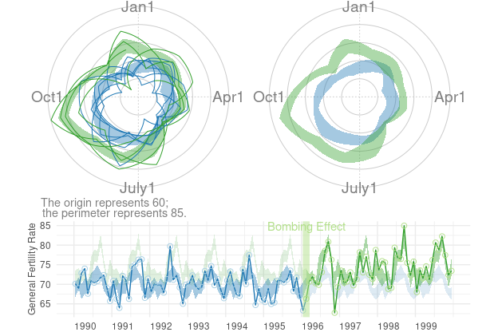

This vignette produces the graphs included in the initial MBR manuscript.


## Figure 1: Cartesian Rolling - 2005 Version
Figure 1:  Raw monthly birth rates (General Fertility Rates;  GFR's) for Oklahoma County, 1990-1999, plotted in a linear plot;  the "bombing effect" is located ten months after the Oklahoma City bombing.


## Figure 2: Cartesian Rolling - 2014 Version
Smoothed monthly birth rates (General Fertility Rates; GFRs) for Oklahoma County, 1990-1999, plotted in a linear plot.  The top plot shows the connected raw data with a February smoother; the middle plot shows smoothing with a 12-month moving average, blue/green line, superimposed on a February smoother, red line); the bottom plot shows the smoothers and confidence bands, which are H-spreads defined using the distribution of GFR's for the given month and 11 previous months.

First, some R packages are loaded, and some variables and functions are defined.


```r
change_month <- base::as.Date("1996-02-15") #as.Date("1995-04-19") + lubridate::weeks(39) = "1996-01-17"
set.seed(444) # So bootstrap won't trigger a git diff

vpLayout <- function(x, y) {
  grid::viewport(layout.pos.row=x, layout.pos.col=y)
}

fullSpread <- function( scores ) {
  return( base::range(scores) ) #A new function isn't necessary.  It's defined in order to be consistent.
}
h_spread <- function( scores ) {
  return( stats::quantile(x=scores, probs=c(.25, .75)) )
}
seSpread <- function( scores ) {
  return( base::mean(scores) + base::c(-1, 1) * stats::sd(scores) / base::sqrt(base::sum(!base::is.na(scores))) )
}
bootSpread <- function( scores, conf=.68 ) {
  plugin <- function( d, i ) {
    base::mean(d[i])
  }

  distribution <- boot::boot(data=scores, plugin, R=99) #999 for the publication
  ci <- boot::boot.ci(distribution, type = c("bca"), conf=conf)
  return( ci$bca[4:5] ) #The fourth & fifth elements correspond to the lower & upper bound.
}

darkTheme <- ggplot2::theme(
  axis.title          = ggplot2::element_text(color="gray30", size=9),
  # axis.text.x         = ggplot2::element_text(color="gray30", margin   = grid::unit(.00001, "cm"), hjust=0),
  # axis.text.y         = ggplot2::element_text(color="gray30", margin   = grid::unit(.00001, "cm")),
  axis.text.x         = ggplot2::element_text(color="gray30", hjust=0),
axis.text.y         = ggplot2::element_text(color="gray30"),
  axis.ticks.length   = grid::unit(0, "cm"),
#   panel.grid.minor.y  = element_line(color="gray95", linewidth=.1),
#   panel.grid.major    = element_line(color="gray90", linewidth=.1),
  panel.spacing       = grid::unit(c(0, 0, 0, 0), "cm"),
  plot.margin         = grid::unit(c(0, 0, 0, 0), "cm")
)
# qplot(mtcars$hp) + darkTheme

lightTheme <- darkTheme + ggplot2::theme(
  axis.title          = ggplot2::element_text(color="gray80", size=9),
  axis.text.x         = ggplot2::element_text(color="gray80", hjust=0),
  axis.text.y         = ggplot2::element_text(color="gray80"),
  panel.grid.minor.y  = ggplot2::element_line(color="gray99", linewidth=.1),
  panel.grid.major    = ggplot2::element_line(color="gray95", linewidth=.1)
)
dateSequence <- base::seq.Date(from=base::as.Date("1990-01-01"), to=base::as.Date("1999-01-01"), by="years")
xScale       <- ggplot2::scale_x_date(breaks=dateSequence, labels=scales::date_format("%Y"))
xScaleBlank  <- ggplot2::scale_x_date(breaks=dateSequence, labels=NULL) #This keeps things proportional down the three frames.
```

### Individual Components
Here is the basic linear rolling graph.  It doesn't require much specification, and will work with a wide range of appropriate datasets.  This first (unpublished) graph displays all components.


```r
# dsLinearAll <- utils::read.csv("./Datasets/county_month_birth_rate_2005_version.csv", stringsAsFactors=FALSE)
# dsLinearAll$date <- base::as.Date(dsLinearAll$date)
# dsLinearOkc <- dsLinearAll[dsLinearAll$county_name=="oklahoma", ]

# Uncomment the next two lines to use the version built into the package.  By default, it uses the
# CSV to promote reproducible research, since the CSV format is more open and accessible to more software.

dsLinearAll <-
  county_month_birth_rate_2005_version |>
  tibble::as_tibble()
# dsLinearAll <- county_month_birth_rate_2005_version
dsLinearOkc <- dsLinearAll[dsLinearAll$county_name=="oklahoma", ]

# dsLinearOkc <-
#   dsLinearAll |>
#   dplyr::filter(county_name == "oklahoma")

dsLinearOkc <- augment_year_data_with_month_resolution(ds_linear=dsLinearOkc, date_name="date")

portfolioCartesian <- annotate_data(dsLinearOkc, dv_name="birth_rate", center_function=stats::median, spread_function=h_spread)

cartesian_rolling(
  ds_linear = portfolioCartesian$ds_linear,
  x_name = "date",
  y_name = "birth_rate",
  stage_id_name = "stage_id",
  change_points = change_month,
  change_point_labels = "Bombing Effect"
)
```


The version for the manuscript was tweaked to take advantage of certain features of the dataset.  This is what it looks like when all three stylized panels are combined.


```r
topPanel <- Wats::cartesian_rolling(
  ds_linear = portfolioCartesian$ds_linear,
  x_name = "date",
  y_name = "birth_rate",
  stage_id_name = "stage_id",
  change_points = change_month,
  y_title = "General Fertility Rate",
  change_point_labels = "Bombing Effect",
  draw_rolling_band = FALSE,
  draw_rolling_line = FALSE
)

middlePanel <- Wats::cartesian_rolling(
  ds_linear = portfolioCartesian$ds_linear,
  x_name = "date",
  y_name = "birth_rate",
  stage_id_name = "stage_id",
  change_points = change_month,
  y_title = "General Fertility Rate",
  change_point_labels = "",
  draw_rolling_band = FALSE,
  draw_jagged_line = FALSE
)

bottomPanel <- Wats::cartesian_rolling(
  ds_linear = portfolioCartesian$ds_linear,
  x_name = "date",
  y_name = "birth_rate",
  stage_id_name = "stage_id",
  change_points = change_month,
  y_title = "General Fertility Rate",
  change_point_labels = "",
#   draw_rolling_band = FALSE,
  draw_jagged_line = FALSE
)

topPanel <- topPanel + xScale + darkTheme
middlePanel <- middlePanel + xScale + darkTheme
bottomPanel <- bottomPanel + xScaleBlank + darkTheme

grid::grid.newpage()
grid::pushViewport(grid::viewport(layout=grid::grid.layout(3,1)))
print(topPanel, vp=vpLayout(1, 1))
print(middlePanel, vp=vpLayout(2, 1))
print(bottomPanel, vp=vpLayout(3, 1))
grid::popViewport()
```


## Figure 4: Cartesian Periodic
Cartesian plot of the GFR time series data in Oklahoma County, with H-spread Bands superimposed.


```r
cartesian_periodic <- Wats::cartesian_periodic(
  portfolioCartesian$ds_linear,
  portfolioCartesian$ds_periodic,
  x_name = "date",
  y_name = "birth_rate",
  stage_id_name = "stage_id",
  change_points = change_month,
  change_point_labels = "Bombing Effect",
  y_title = "General Fertility Rate",
  draw_periodic_band = TRUE #The only difference from the simple linear graph above
)
print(cartesian_periodic)
```


```r
cartesian_periodic <- cartesian_periodic + xScale + darkTheme
print(cartesian_periodic)
```


## Figure 5: Polar Periodic
Wrap Around Time Series (WATS Plot) of the Oklahoma City GFR data, 1990-1999


```r
portfolioPolar <- polarize_cartesian(
  ds_linear = portfolioCartesian$ds_linear,
  ds_stage_cycle = portfolioCartesian$ds_stage_cycle,
  y_name = "birth_rate",
  stage_id_name = "stage_id",
  plotted_point_count_per_cycle = 7200
)

grid::grid.newpage()
polar_periodic(
  ds_linear = portfolioPolar$ds_observed_polar,
  ds_stage_cycle = portfolioPolar$ds_stage_cycle_polar,
  y_name = "radius",
  stage_id_name = "stage_id",
  draw_periodic_band = FALSE,
  draw_stage_labels = TRUE,
  draw_radius_labels = TRUE,
  cardinal_labels = c("Jan1", "Apr1", "July1", "Oct1")
)
```


## Figure 6: WATS and Cartesian
Wrap Around Time Series (WATS Plot) of the Oklahoma City GFR data, 1990-1999


```r
portfolioPolar <- Wats::polarize_cartesian(
  ds_linear = portfolioCartesian$ds_linear,
  ds_stage_cycle = portfolioCartesian$ds_stage_cycle,
  y_name = "birth_rate",
  stage_id_name = "stage_id",
  plotted_point_count_per_cycle = 7200
)

grid::grid.newpage()
grid::pushViewport(grid::viewport(
  layout=grid::grid.layout(
    nrow = 2, ncol = 2, respect = TRUE,
    widths = unit(c(1, 1), c("null", "null")),
    heights = unit(c(1, .5), c("null", "null"))
  ),
  gp = grid::gpar(cex=1, fill=NA)
))

## Create top left panel
grid::pushViewport(grid::viewport(layout.pos.col=1, layout.pos.row=1))
topLeftPanel <- Wats::polar_periodic(
  ds_linear = portfolioPolar$ds_observed_polar,
  ds_stage_cycle_polar = portfolioPolar$ds_stage_cycle_polar,
  y_name = "radius",
  stage_id_name = "stage_id", #graph_ceiling=7,
  cardinal_labels = c("Jan1", "Apr1", "July1", "Oct1")
)
grid::upViewport()

## Create top right panel
grid::pushViewport(grid::viewport(layout.pos.col=2, layout.pos.row=1))
topRightPanel <- Wats::polar_periodic(
  ds_linear = portfolioPolar$ds_observed_polar,
  ds_stage_cycle_polar = portfolioPolar$ds_stage_cycle_polar,
  y_name = "radius",
  stage_id_name = "stage_id", #graph_ceiling=7,
  draw_observed_line = FALSE,
  cardinal_labels = c("Jan1", "Apr1", "July1", "Oct1"),
  origin_label = NULL
)
grid::upViewport()

## Create bottom panel
grid::pushViewport(grid::viewport(layout.pos.col=1:2, layout.pos.row=2, gp=grid::gpar(cex=1)))
print(cartesian_periodic, vp=vpLayout(x=1:2, y=2)) #Print across both columns of the bottom row.
grid::upViewport()
```



## Figure 7: County Comparison
This figure compares Oklahoma County against the (other) largest urban counties.


```r
# dsLinearAll <- Wats::augment_year_data_with_month_resolution(ds_linear=county_month_birth_rate_2005_version, date_name="date")

#Identify the average size of the fecund population
# plyr::ddply(dsLinearAll, "county_name", plyr::summarize, Mean=base::mean(fecund_population))
dsLinearAll |>
  dplyr::group_by(county_name) |>
  dplyr::summarize(
    Mean = base::mean(fecund_population)
  ) |>
  dplyr::ungroup()
```

```
# A tibble: 12 × 2
   county_name     Mean
   <chr>          <dbl>
 1 canadian      18332.
 2 cleveland     48865.
 3 comanche      26268.
 4 creek         13402.
 5 logan          7065.
 6 mcclain        5434.
 7 oklahoma     146882.
 8 osage          8529.
 9 pottawatomie  13604.
10 rogers        13383.
11 tulsa        123783.
12 wagoner       11580.
```

```r
GraphRowComparison <- function( rowLabel="", countyName="oklahoma", spread_function=h_spread, change_month=as.Date("1996-02-15") ) {
  ds_linear <- dsLinearAll[dsLinearAll$county_name==countyName, ]
  ds_linear <- Wats::augment_year_data_with_month_resolution(ds_linear=ds_linear, date_name="date")
  portfolioCartesian <- Wats::annotate_data(ds_linear, dv_name="birth_rate", center_function=stats::median, spread_function=spread_function)
  portfolioPolar <- Wats::polarize_cartesian(ds_linear=portfolioCartesian$ds_linear, ds_stage_cycle=portfolioCartesian$ds_stage_cycle, y_name="birth_rate", stage_id_name="stage_id", plotted_point_count_per_cycle=7200)
  cartesian_periodic <- Wats::cartesian_periodic(portfolioCartesian$ds_linear, portfolioCartesian$ds_periodic, x_name="date", y_name="birth_rate", stage_id_name="stage_id", change_points=change_month, change_point_labels=""  )

  grid::pushViewport(grid::viewport(
    layout=grid::grid.layout(nrow=1, ncol=3, respect=FALSE, widths=grid::unit(c(1.5,1,3), c("line", "null", "null"))),
    gp=grid::gpar(cex=1, fill=NA)
  ))
  grid::pushViewport(grid::viewport(layout.pos.col=1))
  grid.rect(gp=gpar(fill="gray90", col=NA))
  grid.text(rowLabel, rot=90)
  grid::popViewport()

  grid::pushViewport(grid::viewport(layout.pos.col=2))
  # polar_periodic <-
  Wats::polar_periodic(
    ds_linear               = portfolioPolar$ds_observed_polar,
    ds_stage_cycle_polar    = portfolioPolar$ds_stage_cycle_polar,
    draw_observed_line      = FALSE,
    y_name                  = "radius",
    stage_id_name           = "stage_id",
    origin_label            = NULL,
    plot_margins            = c(0, 0, 0, 0)
  )
  grid::popViewport()

  grid::pushViewport(grid::viewport(layout.pos.col=3))
  print(cartesian_periodic + xScale + lightTheme, vp=vpLayout(x=1, y=1))
  grid::popViewport()
  grid::popViewport() #Finish the row
}

counties <- c("comanche", "cleveland", "oklahoma", "tulsa", "rogers")
countyNames <- c("Comanche", "Cleveland", "Oklahoma", "Tulsa", "Rogers")

grid.newpage()
grid::pushViewport(grid::viewport(layout=grid.layout(nrow=length(counties), ncol=1), gp=grid::gpar(cex=1, fill=NA)))
for (i in base::seq_along(counties)) {
  grid::pushViewport(grid::viewport(layout.pos.row=i))
  GraphRowComparison(countyName=counties[i], rowLabel=countyNames[i])
  grid::popViewport()
}
grid::popViewport()
```


Here are all 12 counties that Ronnie collected birth records for.  This extended graph is not in the manuscript.


```r
counties <- base::sort(base::unique(dsLinearAll$county_name))
countyNames <- c("Canadian", "Cleveland", "Comanche", "Creek", "Logan", "McClain", "Oklahoma", "Osage", "Pottawatomie", "Rogers", "Tulsa", "Wagoner")

grid::grid.newpage()
grid::pushViewport(grid::viewport(layout=grid.layout(nrow=base::length(counties), ncol=1), gp=grid::gpar(cex=1, fill=NA)))
for (i in base::seq_along(counties)) {
  grid::pushViewport(grid::viewport(layout.pos.row=i))
  GraphRowComparison(countyName=counties[i], rowLabel=countyNames[i])
  grid::popViewport()
}
grid::popViewport()
```


## Figure 8: Error Band Comparison
This figure demonstrates that WATS accommodates many types of error bands.


```r
spreads <- c("h_spread", "fullSpread", "seSpread", "bootSpread")
spreadNames <- c("H-Spread", "Range", "+/-1 SE", "Bootstrap")
grid::grid.newpage()
grid::pushViewport(grid::viewport(layout=grid::grid.layout(nrow=base::length(spreads), ncol=1), gp=grid::gpar(cex=1, fill=NA)))
for (i in base::seq_along(spreads)) {
  grid::pushViewport(grid::viewport(layout.pos.row=i))
  GraphRowComparison(spread_function=base::get(spreads[i]), rowLabel=spreadNames[i])
  grid::upViewport()
}
grid::upViewport()
```


## Session Info
The current vignette was build on a system using the following software.


```
Report created by wibeasley at Fri 03 Mar 2023 10:38:24 AM CST, -0600
```

```
R version 4.2.2 (2022-10-31)
Platform: x86_64-pc-linux-gnu (64-bit)
Running under: Ubuntu 22.10

Matrix products: default
BLAS:   /usr/lib/x86_64-linux-gnu/blas/libblas.so.3.10.1
LAPACK: /usr/lib/x86_64-linux-gnu/lapack/liblapack.so.3.10.1

locale:
 [1] LC_CTYPE=en_US.UTF-8       LC_NUMERIC=C               LC_TIME=en_US.UTF-8        LC_COLLATE=en_US.UTF-8
 [5] LC_MONETARY=en_US.UTF-8    LC_MESSAGES=en_US.UTF-8    LC_PAPER=en_US.UTF-8       LC_NAME=C
 [9] LC_ADDRESS=C               LC_TELEPHONE=C             LC_MEASUREMENT=en_US.UTF-8 LC_IDENTIFICATION=C

attached base packages:
[1] grid      stats     graphics  grDevices utils     datasets  methods   base

other attached packages:
[1] Wats_0.11.1.9000 boot_1.3-28.1    ggplot2_3.4.1    scales_1.2.1     testit_0.13      markdown_1.5
[7] knitr_1.42

loaded via a namespace (and not attached):
 [1] pkgload_1.3.2      tidyr_1.3.0        bit64_4.0.5        vroom_1.6.1        shiny_1.7.4        highr_0.10
 [7] yaml_2.3.7         remotes_2.4.2      sessioninfo_1.2.2  pillar_1.8.1       backports_1.4.1    lattice_0.20-45
[13] glue_1.6.2         digest_0.6.31      RColorBrewer_1.1-3 promises_1.2.0.1   checkmate_2.1.0    colorspace_2.1-0
[19] htmltools_0.5.4    httpuv_1.6.9       plyr_1.8.8         pkgconfig_2.0.3    devtools_2.4.5     purrr_1.0.1
[25] xtable_1.8-4       processx_3.8.0     archive_1.1.5      later_1.3.0        tzdb_0.3.0         timechange_0.2.0
[31] tibble_3.1.8       farver_2.1.1       generics_0.1.3     usethis_2.1.6      ellipsis_0.3.2     cachem_1.0.7
[37] withr_2.5.0        cli_3.6.0          magrittr_2.0.3     crayon_1.5.2       mime_0.12          memoise_2.0.1
[43] evaluate_0.20      ps_1.7.2           fs_1.6.1           fansi_1.0.4        pkgbuild_1.4.0     profvis_0.3.7
[49] tools_4.2.2        prettyunits_1.1.1  hms_1.1.2          lifecycle_1.0.3    stringr_1.5.0      munsell_0.5.0
[55] callr_3.7.3        compiler_4.2.2     rlang_1.0.6        rstudioapi_0.14    htmlwidgets_1.6.1  miniUI_0.1.1.1
[61] labeling_0.4.2     rmarkdown_2.20     gtable_0.3.1       R6_2.5.1           zoo_1.8-11         lubridate_1.9.2
[67] dplyr_1.1.0        fastmap_1.1.1      bit_4.0.5          utf8_1.2.3         readr_2.1.4        stringi_1.7.12
[73] parallel_4.2.2     Rcpp_1.0.10        vctrs_0.5.2        tidyselect_1.2.0   xfun_0.37          urlchecker_1.0.1
```
